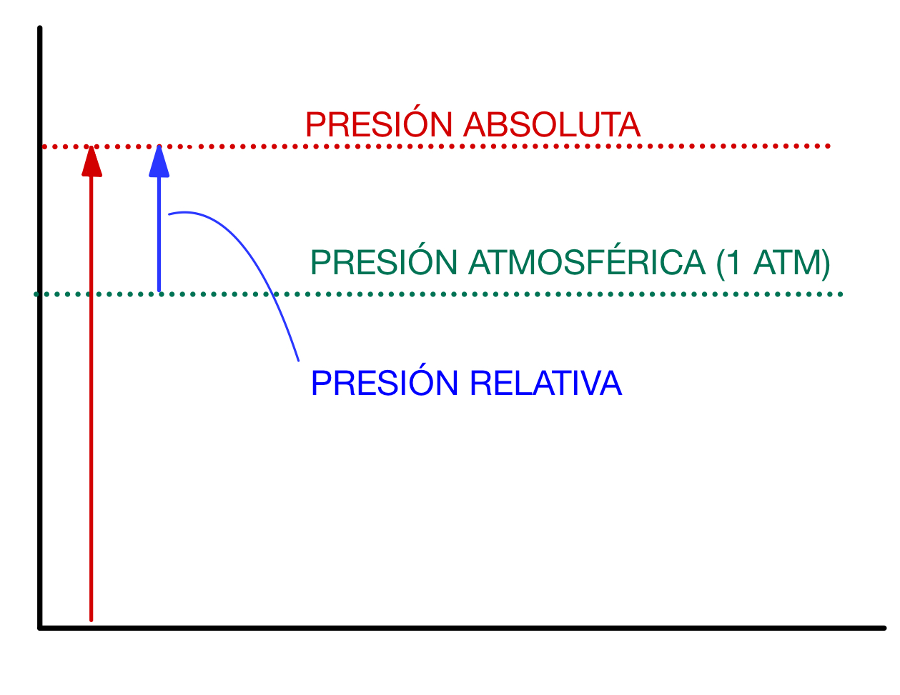
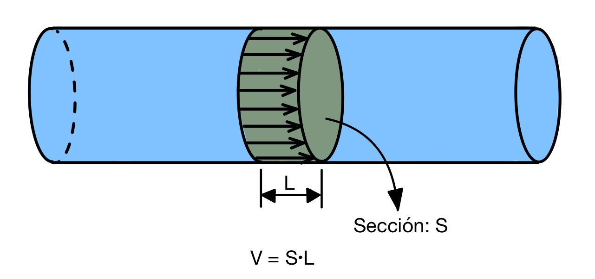
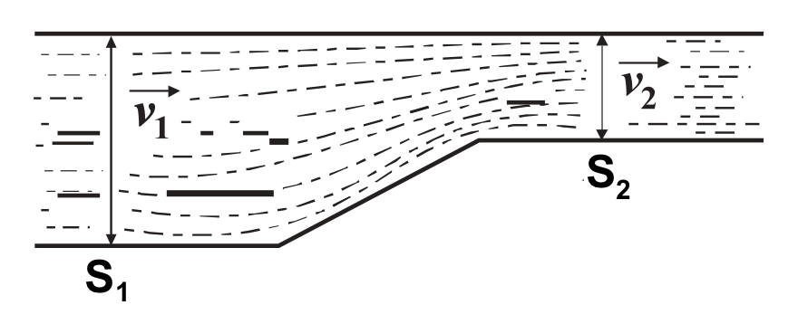
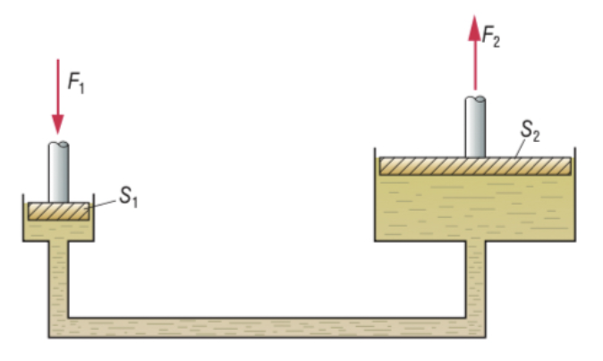
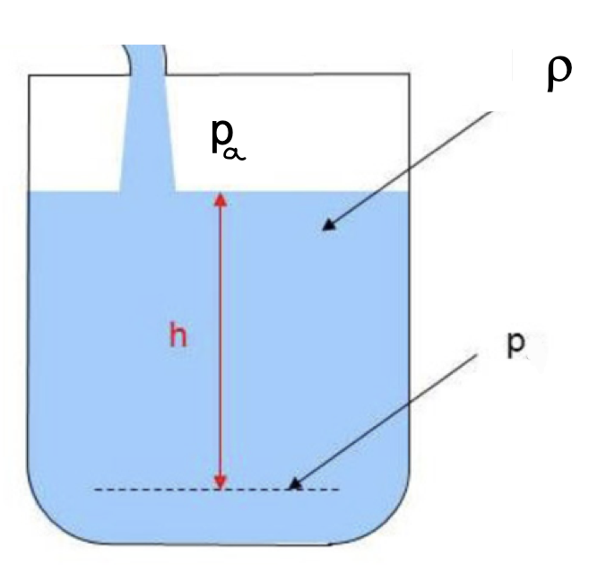
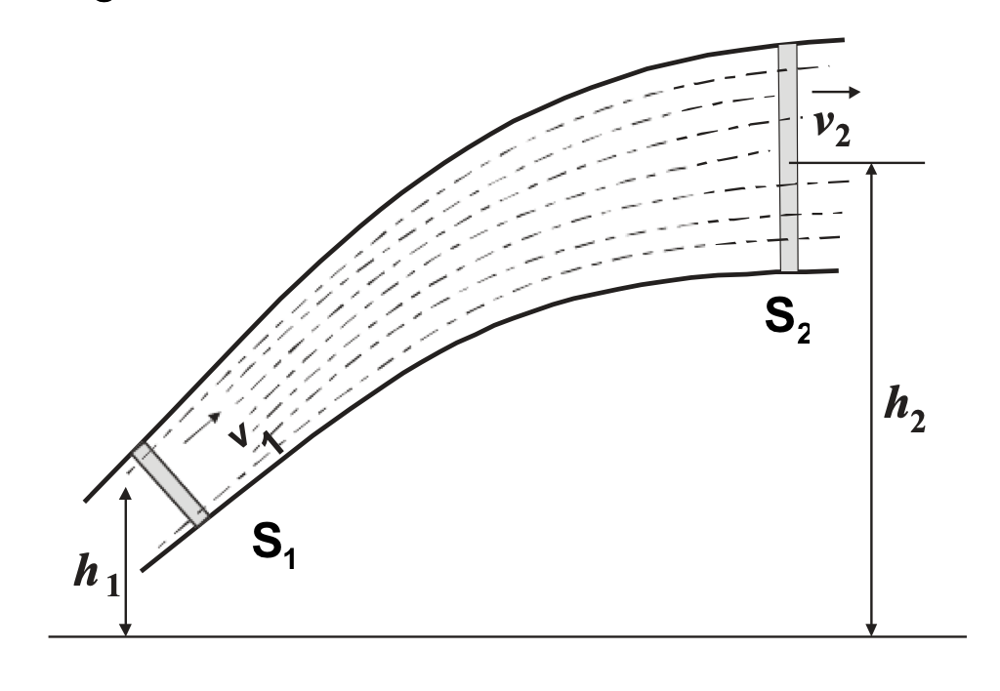
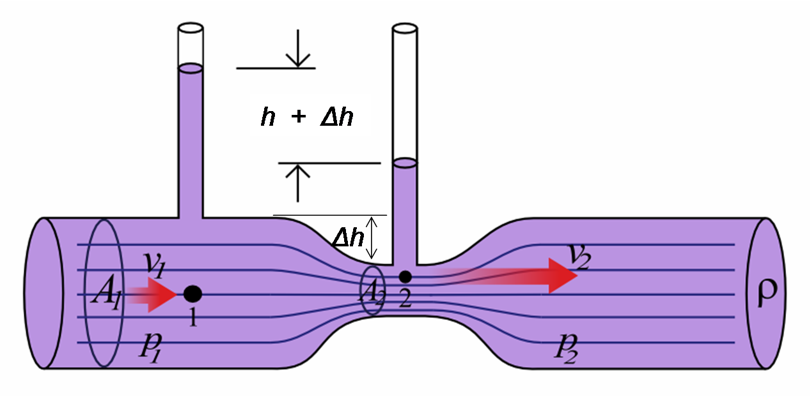

La **neumática** es el estudio y tratamiento del **aire comprimido**, realizado con circuitos e instalaciones neumáticas. Los **circuitos neumáticos** se emplean para transmitir fuerzas y realizar trabajo por medio de aire comprimido.

La **hidráulica** es la rama de la física que estudia el comportamiento de los **fluidos**, (particularmente en estado **líquido**) en función de sus propiedades y de las fuerzas a las que están sometidos. Los **circuitos hidráulicos** utilizan **aceite** y **fluidos sintéticos** para transmitir fuerzas y realizar trabajo, por lo que también son denominados **circuitos oleohidráulicos**.

Algunas de las aplicaciones más extendidas de los circuitos neumáticos e hidráulicos son las siguientes:

* **Transporte**
  * Camiones de basura
  * Frenos
  * Suspensión y amortiguación
  * Accionamiento de puertas

* **Maquinaria (gran potencia)**
  * Máquinas herramienta
  * Tractores
  * Grúas
  * Excavadoras
  * Perforadoras

* **Industria (precisión)**
  * Equipos de montaje
  * Accionamientos de robots
  * Manipulación automática

* **Aeronáutica**
  * Frenos
  * Trenes de aterrizaje

* **Medicina (higiene)**
  * Camas de hospitales
  * Instrumental odontológico

* **Otros**
  * Riego automático
  * Limpieza

La neumática y la hidráulica se basan en principios físicos relacionados con los **fluidos**. El término fluido engloba los **líquidos** y los **gases**. El aire, el aceite y los compuestos sintéticos con los que trabajan los circuitos neumáticos e hidráulicos son fluidos. Por lo tanto, en esta sección estudiaremos las propiedades básicas de los fluidos, así como ciertos principios generales que gobiernan su comportamiento y que serán esenciales para diseñar circuitos neumáticos e hidráulicos.

# Propiedades básicas de los fluidos

A continuación, vamos a estudiar las propiedades más importantes que necesitaremos conocer de los fluidos:

## Densidad ($\rho$)

Suponiendo el fluido homogéneo, la densidad se define como:

::: {.callout-warning appearance="simple" style="width: fit-content; margin: auto; text-align: center;" icon=false}
$$\rho =\frac{m}{V}$$
:::

Donde:

* **$\rho$:** densidad, en kilogramos por metro cúbico (**$kg/m^3$**)
* **$m$:** masa, en kilogramos (**$kg$**)
* **$V$:** volumen, en metros cúbicos (**$m^3$**)

En los **fluidos gaseosos**, como el aire utilizado en las instalaciones neumáticas, **la densidad podrá variar mucho** dependiendo de las condiciones de trabajo del gas (en particular, de su presión), ya que **los gases son compresibles** (al aumentar la presión, disminuyen su volumen).

En los **fluidos líquidos**, como los aceites de las instalaciones oleohidráulicas, para las condiciones de trabajo **la densidad** no sufrirá variaciones medibles, por lo que **se considerará constante** en toda la instalación. **Los fluidos líquidos son incompresibles** en nuestro análisis.

## Presión

Representa la fuerza $F$ ejercida sobre una superficie $S$:

::: {.callout-warning appearance="simple" style="width: fit-content; margin: auto; text-align: center;" icon=false}
$$p =\frac{F}{S}$$
:::

Donde:

* **$p$:** presión, en **pascales ($Pa$)**
* **$F$:** fuerza ejercida, en **newtons ($N$)**
* **$S$:** superficie, en **metros cuadrados ($m^2$)**

Aunque la presión se mide en **pascales ($Pa$)** en el Sistema Internacional de unidades, es habitual expresarla en otras unidades, de las que debemos conocer sus equivalencias:

| UNIDAD | EQUIVALENCIAS |
|:-------|:-------------|
| pascal ($Pa$) | $1 \ Pa = 1 \ N/m^2$ |
| bar ($bar$) | $1 \ bar = 10^5 \ Pa$ |
| atmósfera ($atm$) | $1 \ atm = 101325 \ Pa = 1,01325 \ bar$ |
| kilopondio por centímetro cuadrado ($kp/cm^2$) | $1 \ kp/cm^2 = 9,81 \cdot 10^4 \ Pa = 0,981 \ bar$ |
| milímetro de mercurio ($mmHg$) | $1 \ atm = 760 \ mmHg$ |

De la tabla anterior se deduce que la presión, expresada en $atm$, $bar$ y $kp/cm^2$ nos da unos valores muy aproximados, por lo que, en algunas ocasiones, se pueden aproximar y considerar $1 \ atm \approx 1 \ bar \approx 1 \ kp/cm^2$.

La presión de un fluido se puede expresar en términos absolutos pero, muchas veces, se expresa **referida al valor de la presión atmosférica**, ya que es la **diferencia con esa presión** la que puede **realizar un trabajo útil neto** (dado que las instalaciones funcionan sumergidas en la atmósfera y no en el vacío). Por tanto, distinguiremos entre:

* **Presión absoluta o barométrica ($p_{abs}$):** la obtenida dividiendo la fuerza neta ejercida por las moléculas del fluido sobre la superficie considerada.
* **Presión relativa o manométrica ($p_{man}$):** la obtenida al restar a la presión absoluta el valor de la presión atmosférica ($p_{atm}$).

{fig-align="center" width="400"}

Se cumplirá, por tanto:

::: {.callout-warning appearance="simple" style="width: fit-content; margin: auto; text-align: center;" icon=false}
$$p_{man}=p_{abs}-p_{atm}=\frac{F}{S}-1 \ atm$$
:::

### Presión de vapor

Es la presión que ejercen las moléculas de un líquido al vaporizarse sobre la superficie del líquido. Esta presión depende de la temperatura. Si la presión de vapor se iguala a la del ambiente, el fluido hierve (cambia de fase).

### Cavitación

Fenómeno que produce que en un fluido se forme una bolsa de vapor (de ese fluido) que vuelve a condensarse. Este fenómeno erosiona las partes metálicas que tiene a su alrededor, al someterlas a grandes gradientes de presión, por lo que es indeseable. Se produce cuando la presión en algún punto del fluido es inferior a la presión de vapor, algo que hay que evitar al diseñar la instalación.

## Viscosidad

Es debida al roce entre las moléculas de un fluido. Por lo tanto, representa una medida de la **resistencia del fluido a su movimiento.** En todos los líquidos, **la viscosidad disminuye con el aumento de la temperatura**. La viscosidad de un fluido se suele medir mediante alguna de estas dos magnitudes:

* **Viscosidad dinámica ($\mu$):** se mide en **pascales-segundo ($Pa \cdot s$)** en el Sistema Internacional. Sin embargo, por tradición, es muy habitual tener la viscosidad expresada en una unidad propia del sistema cegesimal, llamada **poise ($P$)**. La equivalencia con el Sistema Internacional es la siguiente: **$1 \ P = 0,1 \ Pa \cdot s$**
* **Viscosidad cinemática ($\nu$):** no es más que la viscosidad dinámica dividida entre la densidad del fluido: $\nu =\frac{\mu}{\rho }$. En el Sistema Internacional se mide en **metros cuadrados por segundo ($m^2/s$)**, aunque también es habitual expresarla en una unidad del sistema cegesimal llamada **stokes ($St$)**. La equivalencia es: **$1 \ St = 0,0001 \ m^2/s$**

### Número de Reynolds ($Re$)

El **número de Reynolds ($Re$)** es un valor adimensional que relaciona las **fuerzas de inercia** que tienden a mover un fluido con las **fuerzas resistentes o viscosas**, que tienden a detenerlo:

::: {.callout-warning appearance="simple" style="width: fit-content; margin: auto; text-align: center;" icon=false}
$$Re =\frac{F_{inercia}}{F_{viscosas}}$$
:::

Para el caso particular de una **tubería de sección circular**, que es lo más habitual en instalaciones hidráulicas, el número de Reynolds puede calcularse con la siguiente expresión:

::: {.callout-warning appearance="simple" style="width: fit-content; margin: auto; text-align: center;" icon=false}
$$Re =\frac{\rho \cdot v \cdot D}{\mu }$$
:::

Donde:

* **$Re$:** número de Reynolds, **adimensional**
* **$\rho$:** densidad del fluido, en **kilogramos por metro cúbico ($kg/m^3$)**
* **$v$:** velocidad del fluido por la tubería, en **metros por segundo ($m/s$)**
* **$D$:** diámetro de la tubería, en **metros ($m$)**
* **$\mu$:** viscosidad dinámica del fluido, en **pascales-segundo ($Pa \cdot s$)**

También se podría expresar el Reynolds directamente en función de la viscosidad cinemática:

::: {.callout-warning appearance="simple" style="width: fit-content; margin: auto; text-align: center;" icon=false}
$$Re =\frac{v \cdot D}{\nu }$$
:::

Cuando las **fuerzas de inercia predominan ($Re$ alto)** en el movimiento del fluido, las diferentes capas del mismo pierden adherencia entre sí y aparecen turbulencias. El fluido tiene un movimiento no estacionario y desordenado. Se dice que el fluido está en **régimen turbulento.**

Por contra, cuando las **fuerzas viscosas son dominantes ($Re$ bajo)**, las diferentes capas del fluido permanecen adheridas entre sí y se mueven de una forma suave, ordenada y continua denominada **régimen laminar**. Se ha establecido empíricamente que, para un flujo interno en tubería circular:

* **Si $Re < 2300 \Rightarrow$ régimen laminar.**
* **Si $Re > 4000 \Rightarrow$ régimen turbulento.**
* **Si está entre esos dos valores, está en régimen de transición.**

En este vídeo puedes ampliar información sobre el régimen laminar y, sobre todo, el **régimen turbulento**:



Os dejo otro vídeo centrado esta vez en el **flujo laminar**:



## Caudal

El caudal representa el volumen de un fluido $V$ que pasa por una sección $S$, transversal a la corriente, en una unidad de tiempo $t$:

::: {.callout-warning appearance="simple" style="width: fit-content; margin: auto; text-align: center;" icon=false}
$$Q=\frac{V}{t}$$
:::

Donde:

* **$Q$:** caudal, en metros cúbicos por segundo (**$m^3/s$**)
* **$V$:** volumen de fluido que atraviesa la sección, en metros cúbicos (**$m^3$**)
* **$t$:** tiempo considerado, en segundos (**$s$**)

En ocasiones, por conveniencia, el caudal se expresa en unidades que no son del SI. En concreto, es frecuente utilizar $l/s$, $l/min$ o $m^3/h$.

Cuando el fluido se desplaza por una tubería de sección transversal $S$ y se mueve a una velocidad constante, podemos expresar el caudal en función de la velocidad que lleva el fluido por la tubería:

{fig-align="center" width="499"}

::: {.callout-warning appearance="simple" style="width: fit-content; margin: auto; text-align: center;" icon=false}
$$Q=\frac{V}{t}=\frac{S \cdot L}{t}=S \cdot v$$
:::

### Potencia necesaria para mover un fluido

Podemos calcular la potencia necesaria para mover un fluido en función de su caudal:

::: {.callout-warning appearance="simple" style="width: fit-content; margin: auto; text-align: center;" icon=false}
$$P=\frac{W}{t}=\frac{F \cdot l}{t}=\frac{p \cdot S \cdot l}{t}=\frac{p \cdot V}{t}=p \cdot Q$$
:::

En el caso de querer mover el fluido con una bomba o compresor que tenga un rendimiento $\eta$, la potencia absorbida por la máquina será:

::: {.callout-warning appearance="simple" style="width: fit-content; margin: auto; text-align: center;" icon=false}
$$P_{abs}=\frac{p \cdot Q}{\eta}$$
:::

# Principios físicos de los gases

Los fluidos cumplen una serie de principios físicos que nos permiten calcular cómo será su evolución y el valor de algunas de sus propiedades a partir de otras. Algunos de estos principios son de aplicación para cualquier tipo de fluido, pero otros son exclusivos de líquidos (pues requieren que la densidad sea constante) o de gases. En esta sección veremos algunos principios físicos propios de los gases:

## Ley de Boyle-Mariott

Si consideramos un **gas perfecto** encerrado en un cilindro en el que provocamos una expansión **isotérmica**, es decir, a temperatura constante, se cumple:

::: {.callout-warning appearance="simple" style="width: fit-content; margin: auto; text-align: center;" icon=false}

$$p_{1} \cdot V_{1}=p_{2} \cdot V_{2}=k$$

:::

## Ley de Charles

Si consideramos un **gas perfecto** encerrado en un cilindro en el que provocamos una expansión **isobárica**, es decir, a presión constante, se cumple:

::: {.callout-warning appearance="simple" style="width: fit-content; margin: auto; text-align: center;" icon=false}

$$\frac{V_{1}}{T_{1}}=\frac{V_{2}}{T_{2}}=k$$

:::

## Ley de Gay-Lussac

Esta ley establece que la presión de un volumen fijo de un gas es directamente proporcional a la temperatura. Es decir, en un **gas ideal** que sufre una transformación **isócora**, es decir, a volumen constante, se cumple:

::: {.callout-warning appearance="simple" style="width: fit-content; margin: auto; text-align: center;" icon=false}

$$\frac{p_{1}}{T_{1}}=\frac{p_{2}}{T_{2}}=k$$

:::

Combinando estas leyes o principios, podemos obtener la **ecuación de los gases perfectos**, que es la siguiente:

::: {.callout-warning appearance="simple" style="width: fit-content; margin: auto; text-align: center;" icon=false}

$$p \cdot V=n \cdot R \cdot T$$

:::

Donde:

* **$p$:** presión, en atmósferas ($atm$) o en pascales ($Pa$)
* **$V$:** volumen, en litros ($l$) o en metros cúbicos ($m^3$)
* **$n$:** número de moles del gas, en moles ($mol$)
* **$T$:** temperatura, en kelvins ($K$)
* **$R$:** constante de los gases. Dependiendo de las unidades utilizadas valdrá:
  * $0,082 \ \frac{atm \cdot l}{K \cdot mol}$
  * $8,314 \ \frac{J}{K \cdot mol}$

# Principios físicos de los líquidos

En esta sección vamos a estudiar algunos principios que se pueden aplicar directamente a los **líquidos**. Son los siguientes:

## Ley de continuidad

Considerando a los líquidos como **incompresibles** y con **densidades constantes**, la ley de continuidad nos dice que **por cada sección de un tubo pasará siempre el mismo caudal**.

En efecto, los caudales serán: $Q_{1}=\frac{V_{1}}{t}$ y $Q_{2}=\frac{V_{2}}{t}$.

Como el líquido es incompresible, $V_1 = V_2$. Por lo tanto, **$Q_1 = Q_2$**.

También vimos antes que el caudal puede ponerse en función de la velocidad del fluido y la sección de paso: $Q = v \cdot S$. Por lo tanto, podemos concluir que:

::: {.callout-warning appearance="simple" style="width: fit-content; margin: auto; text-align: center;" icon=false}

$$v_{1} \cdot S_{1}=v_{2} \cdot S_{2}$$

:::

## Principio de Pascal

La **presión** aplicada a un **fluido confinado** se transmite íntegramente y por igual en todas las direcciones. Este principio se utiliza en la llamada **prensa hidráulica**, que es un dispositivo con dos cilindros de secciones diferentes $S_1$ y $S_2$ unidos por un conducto y rellenos de un fluido hidráulico:

El principio de Pascal nos dice que la presión en todos los puntos del fluido es la misma, por lo que $p_{1}=p_{2}$. Por lo tanto, teniendo en cuenta la definición de presión:

::: {.callout-warning appearance="simple" style="width: fit-content; margin: auto; text-align: center;" icon=false}

$$\frac{F_{1}}{S_{1}}=\frac{F_{2}}{S_{2}}$$

:::

Despejando, podemos ver que **la relación entre las fuerzas en ambos cilindros es la misma que la relación entre las secciones**:

::: {.callout-warning appearance="simple" style="width: fit-content; margin: auto; text-align: center;" icon=false}

$$\frac{F_{1}}{F_{2}}=\frac{S_{1}}{S_{2}}$$

:::

En el caso habitual en que los cilindros son de sección circular con diámetros $D_1$ y $D_2$, la relación entre fuerzas es la de los diámetros **al cuadrado**:

::: {.callout-warning appearance="simple" style="width: fit-content; margin: auto; text-align: center;" icon=false}

$$\frac{F_{1}}{F_{2}}=\frac{S_{1}}{S_{2}}=\frac{\frac{\pi \cdot D_{1}^{2}}{4}}{\frac{\pi \cdot D_{2}^{2}}{4}}=\left( \frac{D_{1}}{D_{2}} \right)^{2}$$

:::

Esto nos puede permitir multiplicar nuestra fuerza muchísimo y por eso los sistemas hidráulicos se utilizan cuando queremos aplicar grandes esfuerzos. Eso sí, todo tiene un precio y es que, aunque nos multiplique la fuerza, lo hará a costa de disminuir el desplazamiento del pistón en el cilindro. Dado que el líquido es incompresible, el volumen que sale del cilindro $1$ es igual al que entra en el cilindro $2$. Por lo tanto:

::: {.callout-warning appearance="simple" style="width: fit-content; margin: auto; text-align: center;" icon=false}

$$l_{1} \cdot S_{1}=l_{2} \cdot S_{2}$$

:::

Donde $l_1$ y $l_2$ son los recorridos del cilindro $1$ y $2$, respectivamente.

### Otras aplicaciones del Principio de Pascal

Además de la **prensa hidráulica**, el principio de Pascal también tiene otras aplicaciones importantes, como:

* **Sistemas de frenado:** estos sistemas usan el principio de Pascal para transmitir la fuerza de frenado a los neumáticos. Al presionar el pedal del freno, se genera una presión que se transmite por un sistema de tubos con líquido de frenos a los neumáticos, lo que los hace frenar. Debido al principio de Pascal, cuando se aplica presión en un lado del sistema, se aplica la misma presión en los neumáticos.
* **Sistemas de riego:** estos sistemas usan presión para impulsar el agua a través de tubos a los campos de cultivo, lo que permite regar de forma uniforme. Debido al principio de Pascal, el agua se mantiene a la misma presión en todo el sistema, independientemente de la altura a la que se encuentre.
* **Sistemas de suministro de agua:** estos sistemas usan la presión de agua para alimentar los grifos y duchas. Esto se debe a que el principio de Pascal permite que el agua se mueva con la misma presión a través de los tubos, lo que permite que el agua salga con la misma presión en todos los grifos.
* **Sistemas de almacenamiento de agua:** estos sistemas usan presión para almacenar el agua en grandes tanques, lo que permite que el agua sea suministrada a las casas y edificios con la misma presión. Debido al principio de Pascal, la presión del agua se mantiene constante a lo largo del sistema.

## Presión hidrostática

En el caso de tener un **fluido en reposo**, la presión total en un punto será la que haya **en la superficie del fluido**, más la debida al **peso del propio fluido que esté por encima**.

Por consiguiente, **la presión depende de la profundidad** a la que nos encontremos:

::: {.callout-warning appearance="simple" style="width: fit-content; margin: auto; text-align: center;" icon=false}

$$p=p_{a}+\rho \cdot g \cdot h$$

:::

Donde:

* **$p$:** presión en el punto considerado, en pascales ($Pa$)
* **$p_a$:** presión en la superficie del líquido, en pascales ($Pa$)
* **$\rho$:** densidad del fluido, en kilogramos por metro cúbico ($kg/m^3$)
* **$g$:** aceleración de la gravedad ($9,81 \ m/s^2$)
* **$h$:** profundidad del punto considerado, medida desde la superficie del fluido, en metros ($m$)

## Teorema de Bernoulli

El teorema de Bernoulli consiste en aplicar el principio de conservación de la energía al flujo de un fluido a través de un conducto. En el caso más general, consideramos un conducto con sección variable y altura también variable como el de la figura:

La energía total del fluido es debida a varios efectos:

* Energía **potencial**: $m \cdot g \cdot h$
* Energía hidrostática debida a la **presión** del fluido: $W = F \cdot l = p \cdot S \cdot l$
* Energía **cinética**: $\frac{1}{2} \cdot m \cdot v^{2}$

Sumando estos tres términos y aplicando el principio de conservación de la energía, podemos escribir que la energía total en el punto $1$ es igual que la energía total en el punto $2$:

::: {.callout-warning appearance="simple" style="width: fit-content; margin: auto; text-align: center;" icon=false}

$$m \cdot g \cdot h_{1}+p_{1} \cdot S_{1} \cdot l_{1}+\frac{1}{2} \cdot m \cdot v^{2}_{1}=m \cdot g \cdot h_{2}+p_{2} \cdot S_{2} \cdot l_{2}+\frac{1}{2} \cdot m \cdot v^{2}_{2}$$

:::

Como, por la ley de continuidad, $S_1 \cdot l_1 = S_2 \cdot l_2 = V$, podemos dividir toda la ecuación anterior entre $V$ y obtenemos la expresión del **teorema de Bernoulli para un líquido**, que es la siguiente:

::: {.callout-warning appearance="simple" style="width: fit-content; margin: auto; text-align: center;" icon=false}

$$\rho \cdot g \cdot h_{1}+p_{1}+\frac{1}{2} \cdot \rho \cdot v^{2}_{1}=\rho \cdot g \cdot h_{2}+p_{2}+\frac{1}{2} \cdot \rho \cdot v^{2}_{2}$$

:::

## Efecto Venturi

El efecto Venturi consiste en que un fluido en movimiento dentro de un conducto cerrado **disminuye su presión cuando aumenta la velocidad** al pasar por una zona de **sección menor**. En ciertas condiciones, cuando el aumento de velocidad es muy grande, se llegan a producir grandes diferencias de presión y entonces, si en este punto del conducto se introduce el extremo de otro conducto, se produce una **aspiración** del fluido de este conducto, que se **mezclará** con el que circula por el primer conducto. El efecto Venturi puede explicarse directamente utilizando el teorema de Bernoulli y la ley de continuidad. Supongamos el sistema de la figura:

Si aplicamos el teorema de Bernoulli en los dos puntos $1$ y $2$, teniendo en cuenta que la tubería es horizontal (se eliminan los términos debidos a la energía potencial):

::: {.callout-warning appearance="simple" style="width: fit-content; margin: auto; text-align: center;" icon=false}

$$p_{1}+\frac{1}{2}\rho \cdot v_{1}^{2}=p_{2}+\frac{1}{2}\rho \cdot v_{2}^{2}$$

:::

Reorganizando, tenemos que:

::: {.callout-warning appearance="simple" style="width: fit-content; margin: auto; text-align: center;" icon=false}

$$p_{1}-p_{2}=\frac{1}{2}\rho \cdot v_{2}^{2}-\frac{1}{2}\rho \cdot v_{1}^{2}$$

:::

Por otra parte, aplicando la ley de continuidad podemos ver claramente que la velocidad en el estrechamiento (punto $2$) es mayor que en el punto $1$:

::: {.callout-warning appearance="simple" style="width: fit-content; margin: auto; text-align: center;" icon=false}

$$S_{1} \cdot v_{1}=S_{2} \cdot v_{2} \ \Rightarrow \ v_{1}=v_{2}\frac{S_{2}}{S_{1}} \ \Rightarrow \ v_{1}< v_{2}$$

:::

Por tanto, de Bernoulli se puede ver que, como $v_{1}< v_{2}$, entonces $p_{1}> p_{2}$

### Ejemplos de aplicación del efecto Venturi

* **Atomizadores:** dispositivos como los pulverizadores de perfume utilizan el efecto Venturi. Al presionar el pulverizador, se acelera el aire, disminuyendo su presión y succionando el líquido, que se mezcla con el aire y se dispersa en forma de pequeñas gotas.
* **Fertirrigación:** un sistema por el cual se disuelve de forma más efectiva un fertilizante en agua para poder regar. No se produce una disolución en sí, sino una inyección directa del soluto en el disolvente, el agua. Lo veremos más adelante al hablar del tubo Venturi.
* **Sistemas de aireación:** En acuarios y sistemas de cultivo hidropónicos, se utilizan dispositivos basados en el efecto Venturi para introducir aire en el agua.
* **Medición de flujos:** Los caudalímetros basados en el principio Venturi miden el caudal de un fluido en un conducto basándose en la variación de presión.

# Ejercicios

## Ejercicios de hidráulica
[EJERCICIOS DE HIDRÁULICA.pdf](media/EJERCICIOS_DE_HIDRAULICA.pdf)

## Colección de ejercicios de selectividad
[EJERCICIOS PAU HIDRAULICA.pdf](media/EJERCICIOS_PAU_HIDRAULICA.pdf)