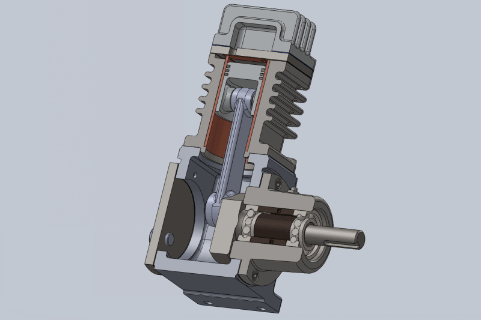
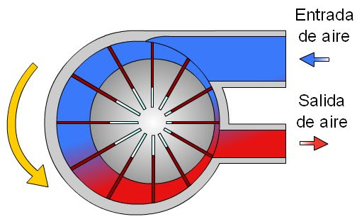
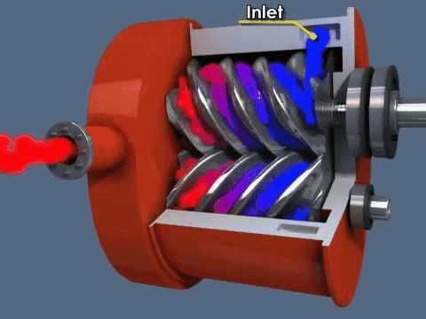
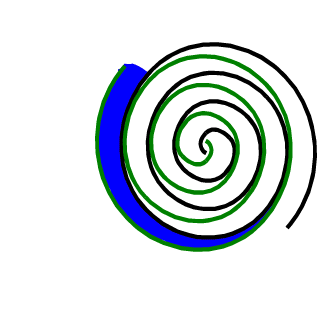
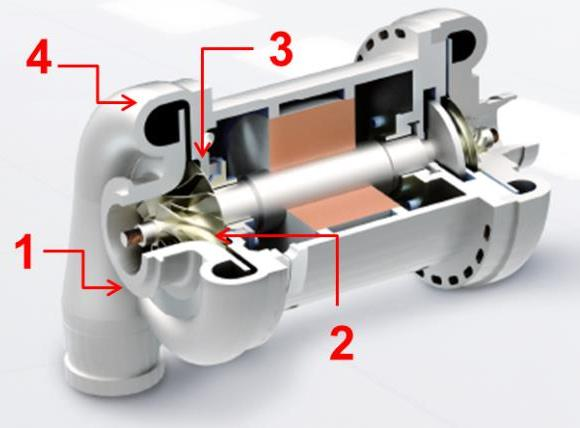
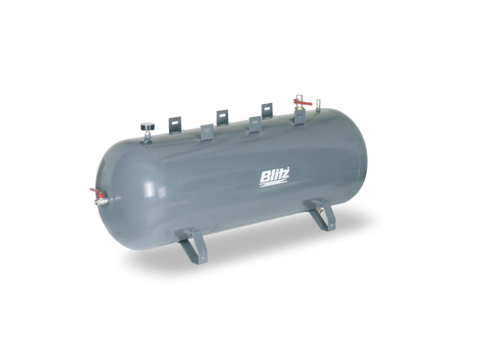
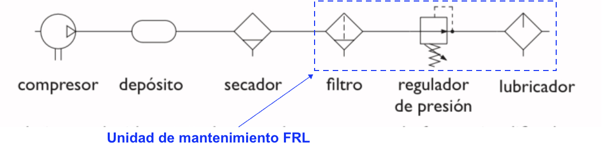
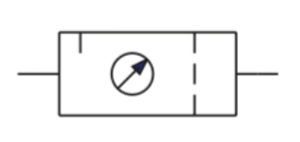
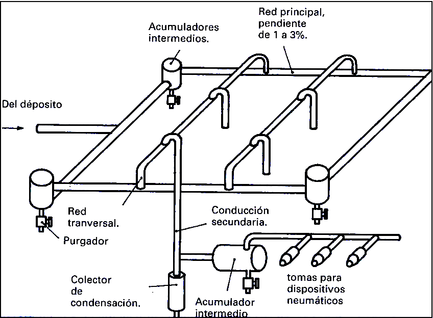

Para que funcione un circuito neumático, el aire es tomado de la atmósfera, sometido a un aumento de presión (es decir, comprimido) y confinado en un espacio reducido como es un depósito.

Ese aumento de presión produce la **condensación del agua presente en la atmósfera**, que podría estropear los elementos metálicos del circuito. Asimismo, el aire debe ser **filtrado** para eliminar las impurezas y, por último, lubricado y regulado para que tenga la presión exacta y necesaria en el circuito.

Todo este proceso constituye la producción y tratamiento del aire comprimido. Los **elementos** necesarios para llevarlo a cabo son los siguientes:

## Compresor {.ex-accordion}

Es el elemento encargado de elevar la presión del aire (presión atmosférica) hasta la presión de trabajo necesaria.

Según las exigencias referentes a la presión de trabajo y al caudal de suministro, se pueden emplear diversos tipos de construcción. Se distinguen dos tipos básicos de compresores:

### De desplazamiento positivo

El principio de funcionamiento de estos compresores se basa en la **disminución del volumen** del aire en la cámara de compresión donde se encuentra confinado, produciéndose el incremento de la presión interna hasta llegar al valor de diseño previsto, momento en el cual el aire es liberado al sistema.

Dentro de esta categoría encontramos compresores alternativos o rotativos:

#### Alternativos
Utilizan un pistón que se mueve alternativamente gracias a un mecanismo de biela-manivela y va comprimiendo el aire.

{fig-align="center" width="300"}

#### Rotativos
Tienen piezas que se mueven de forma rotativa y fuerzan al aire a estar en un recinto con un volumen cada vez menor, con lo que se comprime. Los más utilizados son:

##### De paletas
{fig-align="center" width="199"}

##### De tornillo
{fig-align="center" width="240"}

##### De scroll
{fig-align="center" width="240"}

### Compresores dinámicos

El principio de funcionamiento de estos compresores se basa en la **aceleración** molecular. El aire es aspirado por el rodete a través de su campana de entrada y acelerado a gran velocidad. Después es descargado directamente a unos difusores situados junto al rodete, donde toda la energía cinética del aire se transforma en presión estática. A partir de este punto es liberado al sistema.

{fig-align="center" width="249"}

## Depósito {.ex-accordion}

Estos depósitos están concebidos para acumular aire en su interior y regular el funcionamiento del compresor estabilizando la red de aire comprimido.

{fig-align="center" width="399"}

El aire se mantiene en su interior a la presión de trabajo y se va aportando al sistema cuando sea necesario. En el momento en que la presión en el depósito baja de un valor prefijado, se conecta el compresor y se repone el aire necesario hasta recuperar la presión del depósito.

## Secador {.ex-accordion}

Sirve para **reducir el contenido de vapor de agua** existente en el aire. El aire comprimido seco reduce el riesgo de daños por corrosión del sistema de aire comprimido y mejora el presupuesto operativo de la maquinaria y las herramientas conectadas.

Existen diferentes tipos de secado de aire comprimido:

### Secadores de aire refrigerados o secadores frigoríficos
Enfrían el aire comprimido hasta su **punto de rocío** (aproximadamente unos 5°C), temperatura a la que la humedad del aire **se condensa** después de lo cual se drena. El aire enfriado se recalienta a temperatura ambiente al salir del secador y antes de utilizarlo.

### Secadores de adsorción con desecante
Utilizan **un medio higroscópico poroso** como la alúmina activada y el gel de sílice para extraer la humedad del aire y secarla. Los secadores de aire de adsorción son más adecuados para el secado en una segunda etapa, de lo contrario, el medio higroscópico se saturaría rápidamente. Esto significa que suelen ser el segundo paso después de un secado con otro sistema como un secador frigorífico.

### Secadores de adsorción delicuescentes
Al igual que otros secadores de adsorción, pasan el aire a través de un medio higroscópico para secarlo, pero, a diferencia de los secadores de aire con desecante, los secadores de aire delicuescentes utilizan **tabletas de sal solubles** en lugar de un medio sólido que necesita regeneración. La salmuera resultante necesita ser drenada y las tabletas reemplazadas cada cierto tiempo.

### Secadores de membrana
Como su nombre indica, pasa aire entrante sobre una **membrana higroscópica** para eliminar la humedad. El aire se acumula en la membrana hasta que migra a través del otro lado, que es de baja presión. Un gas seco es entonces atravesado, llevando la humedad lejos para la expulsión. A menudo son secadoras de segunda o incluso tercera etapa.

## Filtro {.ex-accordion}

Se utiliza para filtrar las impurezas del aire atmosférico, como el polvo, el aceite y la humedad, a fin de que el aire comprimido sea viable para su uso.

Al igual que los secadores de aire, son una parte crucial del proceso de tratamiento del aire para asegurarse de que el aire comprimido está limpio y es seguro de usar, y para aumentar la vida útil del equipo.

Los filtros de línea de aire más comunes y sus principios básicos de funcionamiento son:

### Filtros de partículas
Eliminan el polvo y otras partículas del aire después de la compresión, atrapándolas y reteniéndolas dentro del compresor de aire. A menudo se combinan con el secador de aire de adsorción.

### Filtros de aire de carbón activo
Eliminan los gases y olores del aire con un medio de carbono compuesto. Estos filtros se utilizan a menudo en la industria alimentaria y para respirar gas.

### Filtros de aire coalescentes
Filtran el aceite y las partículas de agua del aire y las condensan en una masa que se puede limpiar fácilmente. A diferencia de los separadores de Aceite-Agua, los filtros de aire coalescentes sólo eliminan la humedad y los aerosoles de aceite, no el líquido real.

### Filtros de admisión de aire comprimido
Eliminan los contaminantes microscópicos del aire, así como las posibles partículas químicas.

## Regulador de presión {.ex-accordion}

Tiene por objeto mantener el aire a una presión constante, que se determine como necesaria, evitando las variaciones que pueda ocasionar el consumo de aire de la instalación. Los reguladores de presión suelen incorporar un manómetro.

Se usan cuando el aire comprimido entrante debe regularse a un valor deseado y preestablecido, independiente de las condiciones externas y del funcionamiento de otros equipos.

Algunos ejemplos de activos industriales que necesitan regulación de aire son:

* Pistolas de soplado
* Equipo de medición de aire
* Cilindros de aire
* Motores de aire
* Dispositivos de pulverización
* Sistemas de lubricación en aerosol

## Lubricador {.ex-accordion}

En su interior se mezcla el aire con aceite, para intentar aumentar la vida útil y el rendimiento de los circuitos neumáticos. Evita la corrosión y detiene el desgaste de piezas.

Los aceites se utilizan cuando las herramientas neumáticas, los controles neumáticos, etc. deben operar con una cantidad determinada de aceite para evitar el desgaste prematuro por exceso de fricción.

La mayoría de las herramientas neumáticas y otros equipos impulsados por aire necesitan de lubricación periódica para extender su durabilidad.

## Simbología

En los circuitos neumáticos, cada uno de estos elementos tiene un símbolo que puedes ver a continuación:

{fig-align="center" width="701"}

Como ves, al conjunto del filtro, el regulador de presión y el lubricador se le conoce con el nombre de **Unidad de mantenimiento FRL** (filtro, regulador, lubricador), ya que se suele instalar como una unidad compacta que se encarga de realizar esas funciones. Esta unidad de mantenimiento tiene su propio símbolo para representarla como un único elemento en los circuitos neumáticos:

{fig-align="center" width="150"}

Como los elementos de acondicionamiento de aire aparecen en todos los circuitos y siempre son los mismos, el conjunto de todos ellos se suele representar mediante un símbolo simplificado que se conoce como **fuente de presión**:

{fig-align="center" width="90"}

::: {.callout-important}
Cuando veas este símbolo en un circuito, ¡recuerda que tiene mucho más detrás que "simplemente" aportar aire a presión!
:::

Un **sistema de distribución de aire** está diseñado para proporcionar un suministro ininterrumpido de aire comprimido justo donde se necesita. Normalmente, un sistema de red de aire comprimido consta de **tuberías**, **racores** y **accesorios de punto de uso**. Una buena red de **tuberías de distribución** de aire transporta el aire comprimido desde la fuente hasta el punto de uso en condiciones óptimas:

* Mínima caída de presión
* Máximo caudal
* Máxima calidad del aire

Normalmente la red de distribución de aire comprimido se divide en dos zonas: la red principal y la red secundaria.

{fig-align="center" width="440"}

## Red principal {.ex-accordion}

Es la que proviene directamente del sistema de acondicionamiento del aire comprimido. Sus características principales son:

* **Tubos de mayor diámetro:** puesto que todo el aire comprimido del sistema pasa por esta primera zona de la instalación. Además, suele sobredimensionarse por si hay que ampliar en el futuro la instalación.

* **Forma de parrilla:** normalmente se adopta esa forma de red para garantizar que el aire llegue por diferentes caminos a los puntos de utilización. Así se garantiza el funcionamiento aunque haya alguna avería o mantenimiento en otro punto de la instalación.

* **Pendiente del 1% al 3%:** por si aparece alguna condensación, que no se quede atrapada en los tubos y se deslice para ser purgada del sistema.

* **Evitar cambios bruscos de sección y dirección:** las tuberías deben ser lo más rectas y uniformes posible, para evitar pérdidas de presión.

## Red secundaria {.ex-accordion}

Es la parte de la instalación donde se encuentran las tuberías finales que llevan el aire comprimido a los actuadores. Tendremos en cuenta algunas consideraciones a la hora de diseñarla:

* Para evitar detener el suministro de aire comprimido en la red cuando se hagan reparaciones de fugas, nuevas instalaciones y operaciones de mantenimiento es esencial que se ubiquen **llaves de paso** frecuentemente en la red.

* Las **tomas de aire** para los actuadores no deben de hacerse nunca en la parte inferior de la tubería sino en la **parte superior**, para evitar que el agua condensada que circula por defecto de la gravedad pueda ser recogida y llevada a los distintos equipos neumáticos conectados a la red.

## Pérdidas de presión {.callout-warning}

En general, debe intentarse que la **pérdida de presión** que experimente el aire debido a la fricción en los tubos, codos, válvulas, etc., **no supere el 5%** de la presión nominal de trabajo. 

En general, a mayor diámetro de las tuberías, menos pérdida de carga. Pero, dado que hay que mantener una velocidad del aire de entre 6 a 10 m/s en los tubos, mayor diámetro implica mayor caudal, lo que encarece todo el sistema (compresor, unidad de mantenimiento, depósitos, etc). 

Hay que intentar diseñar la instalación de manera óptima, aunque es un cálculo complicado y, en la práctica, suele sobredimensionarse un poco por si acaso.

