Los actuadores neumáticos son los encargados de **transformar la presión** del aire comprimido en un **trabajo útil**. Existen múltiples dispositivos capaces de realizar esta tarea, pero los más utilizados son básicamente de dos tipos:

* Rotativos: como los motores
* Lineales: como los cilindros

# Motores

Se utilizan cuando es necesario lograr **giros continuos**. Las ventajas de estos motores son su buena relación potencia-peso, así como la ausencia de problemas de sobrecalentamiento ante sobrecargas. La mayoría de los motores neumáticos son de **paletas**, aunque también existen aquellos que basan su funcionamiento en el uso de **pistones** o en una **turbina**.

En el siguiente vídeo se muestra un ejemplo de motores neumáticos aplicados a un brazo robótico:



# Cilindros

Transforman la energía del aire comprimido en un movimiento **lineal**. Son tubos cilíndricos cerrados, dentro de ellos existe un émbolo que se desplaza unido a un vástago que lo atraviesa.

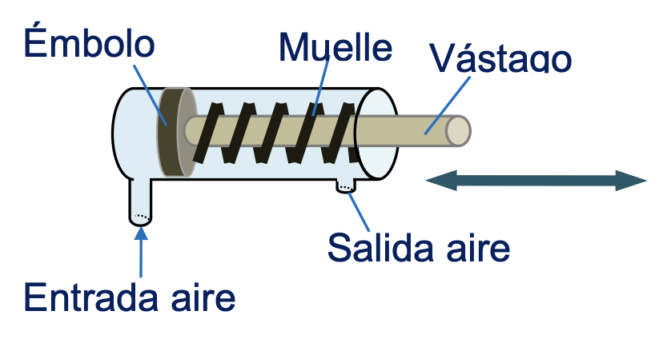{fig-align="center" width="400"}

Existen dos tipos distintos de cilindros neumáticos según su forma de accionamiento:

## De simple efecto

Tienen una sola conexión para entrada de aire. Solo se aprovecha la fuerza a la salida del vástago. Su símbolo es el siguiente:

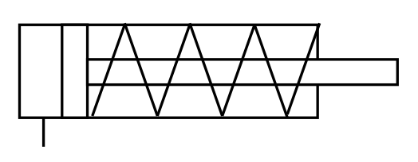{fig-align="center" width="259"}

Cuando introducimos aire por la tubería de la izquierda, sale el émbolo. Cuando dejamos de introducir aire el vástago retorna por el efecto de un muelle.

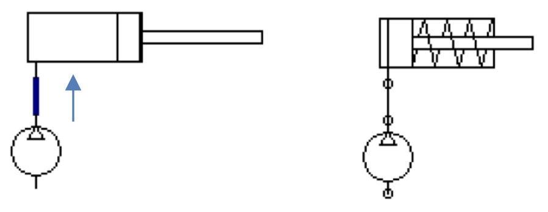{fig-align="center" width="449"}

## De doble efecto

Llevan dos tomas de aire (una a cada lado del émbolo). Pueden realizar trabajo en ambos sentidos, porque se les aplica la presión en ambas caras del émbolo. Su símbolo es el siguiente:

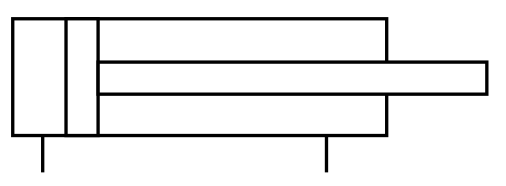{fig-align="center" width="261"}

Cuando introducimos aire por la tubería de la izquierda, sale el émbolo. Cuando introducimos aire por la tubería de la derecha, el émbolo entra.

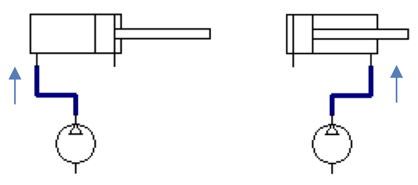{fig-align="center" width="451"}

Aquí tienes un vídeo donde puedes ver con más detalle tanto el funcionamiento como la construcción de los cilindros neumáticos:



# Cálculos de magnitudes en cilindros neumáticos

Debido a la importancia de los cilindros en los sistemas de aire comprimido (y también porque lo preguntan en la PAU), vamos a analizar cómo se pueden calcular sus magnitudes más importantes.

## Parámetros geométricos

Los parámetros geométricos principales de un cilindro son los siguientes:

* Diámetro del pistón ($D$)
* Diámetro del vástago ($d$)
* Carrera ($L$)

Los puedes ver indicados en la siguiente imagen sobre un cilindro de simple efecto y uno de doble efecto:

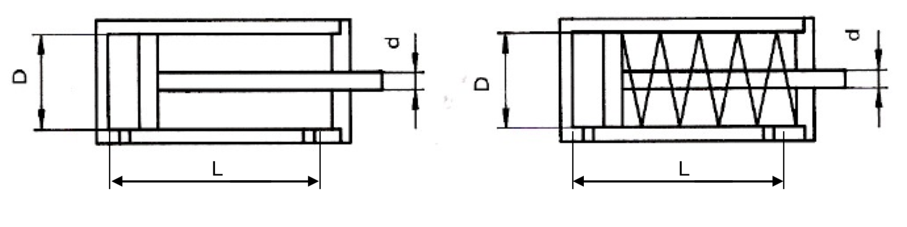{fig-align="center" width="799"}

## Presión de trabajo

Normalmente la presión de trabajo del cilindro será un dato conocido que nos vendrá dado en bares, en atmósferas o en pascales. Las presiones más habituales de los cilindros neumáticos suelen estar entre los $6 \ \text{bar}$ y, como máximo, los $10 \ \text{bar}$.

Al analizar los cilindros **hablaremos siempre de presiones relativas (manométricas),** para no tener que estar restando siempre las fuerzas producidas por la presión del ambiente sobre las diferentes piezas del cilindro.

## Volumen de aire en el cilindro

El volumen de aire que entra en un cilindro viene determinado por el volumen disponible dentro del mismo. Este volumen no es el mismo en la carrera de avance y en la de retroceso en un cilindro de doble efecto.

En la **carrera de avance** de un cilindro (tanto de **simple** como de **doble efecto**), el volumen máximo disponible es el que queda entre el pistón y las paredes del cilindro cuando se ha avanzado toda la carrera. Es decir:

::: {.callout-warning appearance="simple" style="width: fit-content; margin: auto; text-align: center;" icon=false}

$$V_{avance}=\frac{\pi \cdot D^{2}}{4} \cdot L$$

:::

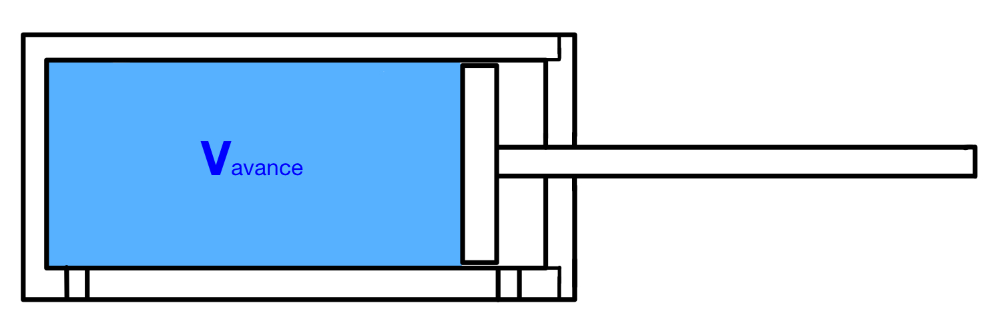{fig-align="center" width="500"}

En la **carrera de retroceso** de un cilindro de **doble efecto**, la cantidad de aire que entra para empujar el émbolo hacia dentro es ligeramente menor que en la carrera de avance, porque **el vástago ocupa un volumen** que no puede ocupar el aire. Por lo tanto:

::: {.callout-warning appearance="simple" style="width: fit-content; margin: auto; text-align: center;" icon=false}

$$V_{retroceso}=V_{cilindro}-V_{vástago}=\frac{\pi \cdot D^{2}}{4} \cdot L-\frac{\pi \cdot d^{2}}{4} \cdot L=\frac{\pi \cdot (D^{2}-d^{2})}{4} \cdot L$$

:::

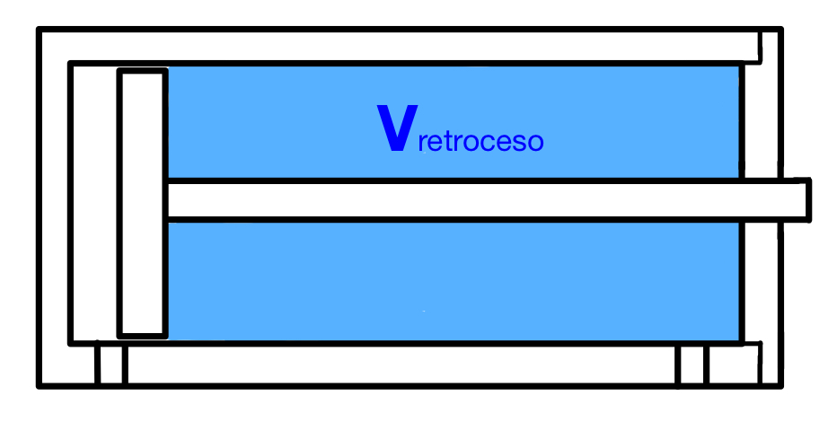{fig-align="center" width="319"}

En un **cilindro de doble efecto**, el aire consumido en una **embolada completa (una carrera de avance más otra retroceso)** será, por lo tanto:

::: {.callout-warning appearance="simple" style="width: fit-content; margin: auto; text-align: center;" icon=false}

$$V_{embolada}=V_{avance}+V_{retroceso}=\frac{\pi \cdot D^{2}}{4} \cdot L+\frac{\pi \cdot (D^{2}-d^{2})}{4} \cdot L=\frac{\pi \cdot (2D^{2}-d^{2})}{4} \cdot L$$

:::

En un **cilindro de simple efecto**, el aire consumido en una embolada completa será simplemente el consumido en el avance:

::: {.callout-warning appearance="simple" style="width: fit-content; margin: auto; text-align: center;" icon=false}

$$V_{embolada}=V_{avance}=\frac{\pi \cdot D^{2}}{4} \cdot L$$

:::

Hay que tener en cuenta que, como el aire es compresible, este volumen es la **cantidad de aire que entra a la presión de trabajo**. Si queremos calcular a cuánto volumen de aire equivale **medido en condiciones normales ($1 \ \text{atm}$ de presión)**, tenemos que utilizar la **ley de Boyle-Mariotte**:

::: {.callout-warning appearance="simple" style="width: fit-content; margin: auto; text-align: center;" icon=false}

$$p_{cn} \cdot V_{cn}=p_{trabajo} \cdot V_{trabajo}$$

:::

Como la presión en condiciones normales es $1 \ \text{atm}$ por definición, el **volumen de aire, medido en condiciones normales** será:

::: {.callout-warning appearance="simple" style="width: fit-content; margin: auto; text-align: center;" icon=false}

$$V_{cn}=V_{trabajo} \cdot \frac{p_{trabajo}}{1\ \text{atm}}$$

:::

## Caudal de aire necesario

El caudal de aire sabemos que es el volumen que entra en el cilindro dividido entre el tiempo que tarda en entrar. Conociendo el tiempo en que debe actuar el cilindro y sus dimensiones, podemos calcular el caudal de aire que necesitaremos aportarle.

En general, para el avance necesitaremos un caudal de aire y para el retroceso (en el caso de cilindro de doble efecto) otro:

::: {.callout-warning appearance="simple" style="width: fit-content; margin: auto; text-align: center;" icon=false}

$$Q_{avance}=\frac{V_{avance}}{t_{avance}}; \ \ Q_{retroceso}=\frac{V_{retroceso}}{t_{retroceso}}$$

:::

Normalmente no tendremos como dato directamente el tiempo sino la **frecuencia de funcionamiento del cilindro ($f$), en emboladas por minuto**. En este caso, el caudal de aire consumido en una embolada será el siguiente:

Cilindro de simple efecto: $Q_{embolada}=V_{avance} \cdot f$

Cilindro de doble efecto: $Q_{embolada}=(V_{avance}+V_{retroceso}) \cdot f$

Recuerda que estos caudales son siempre **medidos en las condiciones de trabajo del cilindro**. Para calcularlos **en condiciones normales**, hay que **multiplicarlos por la presión de trabajo en atmósferas** (ley de Boyle-Mariotte).

## Fuerza ejercida por el cilindro

Distinguiremos entre cilindros de doble efecto y cilindros de simple efecto:

### Cilindro de doble efecto

Considerando que **$p=\frac{F}{S}$**, y teniendo en cuenta que habrá una **fuerza de rozamiento ($F_R$)** del pistón contra las paredes del cilindro, podemos deducir la expresión de la fuerza neta ejercida por el cilindro, distinguiendo entre avance y retroceso.

#### Fuerza en el avance

En el avance, el aire ejerce presión sobre **toda la superficie del pistón**, por lo tanto:

::: {.callout-warning appearance="simple" style="width: fit-content; margin: auto; text-align: center;" icon=false}

$$F_{avance}=p \cdot \frac{\pi \cdot D^{2}}{4}-F_{R}$$

:::

#### Fuerza en el retroceso

A la hora de realizar el retroceso, la superficie disponible para empujar es menor, pues **hay una zona ocupada por el vástago cuya superficie hay que restar**. La expresión de la fuerza queda así:

::: {.callout-warning appearance="simple" style="width: fit-content; margin: auto; text-align: center;" icon=false}

$$F_{retroceso}=p \cdot \frac{\pi \cdot (D^{2}-d^{2})}{4}-F_{R}$$

:::

La **fuerza de rozamiento** depende de la velocidad del pistón, la presión de funcionamiento y los materiales del cilindro. Puede venir dada por un valor en newtons, pero, normalmente, nos la darán como porcentaje de la fuerza teórica (la que se daría de no haber rozamiento). Así, por ejemplo, si nos dicen que la fuerza de rozamiento es el $15\ \%$ de la fuerza teórica de avance, tendríamos que:

::: {.callout-warning appearance="simple" style="width: fit-content; margin: auto; text-align: center;" icon=false}

$$F_{avance}=F_{T avance}-F_{R}=F_{Tavance}-0,15 \cdot F_{Tavance}=0,85 \cdot F_{Tavance}=0,85 \cdot p \cdot \frac{\pi \cdot D^{2}}{4}$$

:::

### Cilindro de simple efecto

En este caso, además de la fuerza de rozamiento, tenemos que tener en cuenta la **fuerza que produce el muelle ($F_M$)** que tiene el cilindro para retroceder al cesar la presión de avance. La expresión de la fuerza será:

#### Fuerza en el avance

Será como la del cilindro de doble efecto, pero añadiendo la fuerza del muelle (restando porque, como ocurre con el rozamiento, es una fuerza que se opone al movimiento):

::: {.callout-warning appearance="simple" style="width: fit-content; margin: auto; text-align: center;" icon=false}

$$F_{avance}=p \cdot \frac{\pi \cdot D^{2}}{4}-F_{R}-F_{M}$$

:::

#### Fuerza en el retroceso

Al producirse el retroceso por efecto del muelle, la presión del aire no solo no contribuye al movimiento sino que se opondría a él si es mayor que la presión atmosférica. Como, normalmente, al retroceder se abrirá la válvula totalmente y la presión pasará a ser la atmosférica (**presión manométrica igual a $0$**), no influirá en el movimiento. Por tanto, la fuerza en el retroceso será la que proporcione el muelle (ahora positiva porque va según el movimiento), menos la fuerza de rozamiento (que siempre se opone al movimiento):

::: {.callout-warning appearance="simple" style="width: fit-content; margin: auto; text-align: center;" icon=false}

$$F_{retroceso}=F_{M}-F_{R}$$

:::

La **fuerza del muelle** puede calcularse conociendo su constante elástica y aplicando la ley de Hooke, aunque es posible que sea variable durante la carrera de avance. Se consideraría la máxima, que sería cuando el muelle estuviera comprimido al máximo (al final de la carrera, es decir: $F_{M}=k \cdot L$). De todas formas, también será muy habitual que nos la den como **porcentaje de la fuerza teórica de avance**, al igual que la fuerza de rozamiento.

# Ejercicios PAU

Para practicar estos conceptos, puedes resolver los ejercicios de la colección:

[EJERCICIOS PAU CILINDROS.pdf](media/EJERCICIOS_PAU_CILINDROS.pdf)

# Válvulas
Para regular y controlar el caudal y la presión con la que el aire llega a los diferentes puntos de consumo, se utilizan unos dispositivos denominados **válvulas**.

Las válvulas pueden ser de varios tipos según su finalidad:

* **Válvulas de vías o distribuidoras:** determinan el camino que ha de tomar la corriente de aire.
* **Válvulas de bloqueo:** bloquean el paso del caudal de aire o lo dejan pasar, según queramos.
* **Válvulas de caudal:** regulan la cantidad de caudal de aire por una zona de la instalación.

# Válvulas distribuidoras

Son los componentes que determinan el camino que ha de tomar la corriente de aire. Todas estas válvulas se definen por tres características funcionales:

* Número de **vías** u orificios que tienen.
* Número de **posiciones** que pueden tomar.
* Tipo de **accionamiento** y de **retorno** que necesitan para pasar de una posición a otra.

Todas estas características se reflejan en el **símbolo** de la válvula como veremos a continuación:

## Vías

Las vías (o agujeros) tienen una serie de líneas internas y externas al símbolo de la válvula que indican lo siguiente:

:::: {.columns}
::: {.column width="50%"}
### Líneas internas

{width="70"}

Las líneas indican **tuberías**. La flecha indica el sentido de paso del aire comprimido.

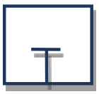{width="70"}

Este símbolo indica un **bloqueo**. El aire no puede pasar por ese orificio de la válvula.
:::

::: {.column width="50%"}
### Líneas externas

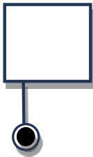{width="70"}

Toma de presión

{width="70"}

Aire evacuado a la atmósfera (escape directo)

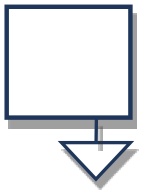{width="70"}

Aire evacuado a la atmósfera (escape indirecto)
:::
::::

## Posiciones

Cada posición se representa mediante un cuadrado:

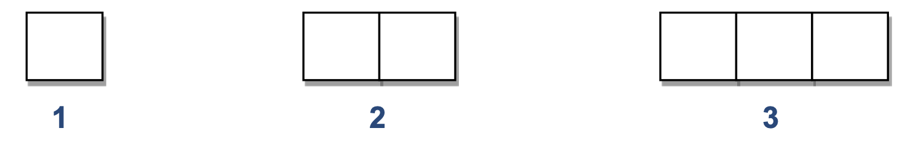{fig-align="center" width="702"}

Lo normal son 2 posiciones (reposo y trabajo). Pero hay válvulas con otra posición **neutra central**.

La **posición inicial** es la que se obtiene al dar presión y es **en la que se dibujan conectadas las vías exteriores** de la válvula. Es la posición a partir de la cual empieza el programa establecido. La segunda posición se obtendría **desplazando lateralmente los cuadrados**.

Aquí tienes algunos ejemplos de válvulas distribuidoras muy usadas:

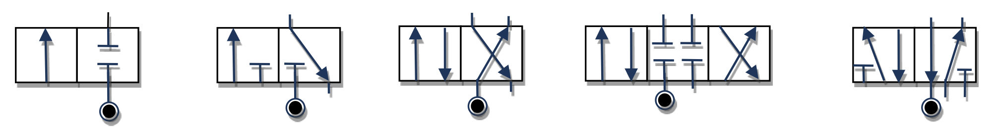{fig-align="center" width="803"}

## Tipo de accionamiento-retorno

En general, las válvulas pueden tener cuatro tipos distintos de accionamiento: manual, mecánico, neumático o eléctrico. Aquí tienes los tipos de accionamientos o retornos de válvulas más comunes y sus símbolos correspondientes:

### Accionamientos manuales

Están pensados para ser accionados **directamente por un operario**. Los más básicos son estos:

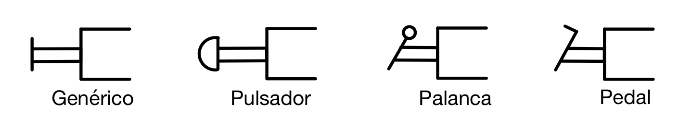{fig-align="center" width="700"}

### Accionamientos mecánicos

Están pensados para accionarse **automáticamente** cuando ocurra algo (normalmente, cuando se detecte una pieza en algún punto del sistema). También se incluye aquí el **retorno** mediante un muelle o resorte de la válvula a una posición inicial cuando cese la fuerza que la ha accionado.

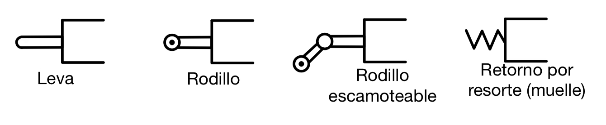{fig-align="center" width="699"}

### Accionamientos neumáticos

La válvula se mueve mediante la acción de la misma presión de aire comprimido del sistema. Si la válvula no es muy grande puede moverse directamente utilizando un flujo de aire de control de menor presión, pero si es pesada necesita aire a alta presión, que le será proporcionado en el momento oportuno por una pequeña válvula auxiliar. Es el llamado **servopilotaje**.

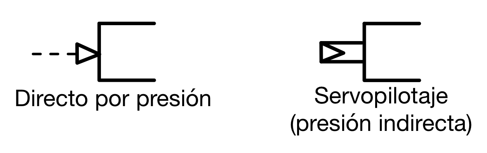{fig-align="center" width="400"}

El **servopilotaje** se utiliza en válvulas distribuidoras de gran tamaño, para evitar un esfuerzo grande en el accionamiento. Es un pilotaje neumático indirecto. Consiste en actuar en realidad sobre una pequeña válvula, que se comunica y deja pasar el aire comprimido para accionar la válvula principal. Todo el conjunto va montado sobre la misma válvula.

### Accionamientos eléctricos

Funcionan mediante una **bobina solenoide** que, al recibir una corriente eléctrica, genera un campo magnético que atrae un componente metálico, accionando la válvula.

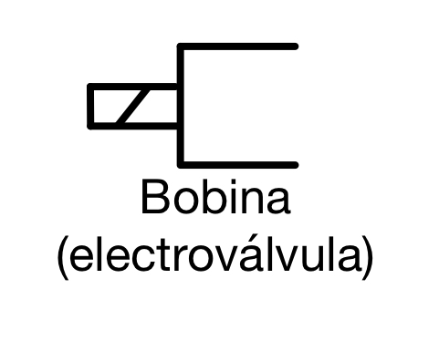{fig-align="center" width="180"}

Las electroválvulas son **las más utilizadas en la actualidad** en los sistemas neumáticos porque se pueden controlar directamente desde un **PLC (Programmable Logic Controller)** que emite las señales eléctricas que accionan las válvulas automáticamente.

::: {.callout-note}
## PLC
El "PLC" (Programmable Logic Controller, por sus siglas en inglés) es un dispositivo electrónico que se programa para realizar acciones de control automáticamente. Un PLC es un cerebro que activa componentes de maquinarias para ejecuten tareas que pudieran ser peligrosas para el ser humano o muy lentas o imperfectas.
:::

### Accionamientos combinados

Es posible combinar varios accionamientos en una misma válvula, como puedes ver en este ejemplo:

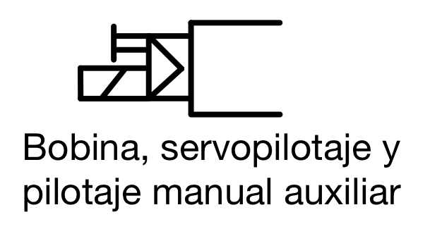{fig-align="center" width="230"}

### Válvulas biestables y monoestables

Las válvulas pueden ser de dos tipos según permanezcan o no en la posición en que se han colocado:

* **Biestables:** la válvula se mantiene en cualquier posición en que la coloquemos y no cambiará hasta que volvamos a accionarla.
* **Monoestables:** la válvula sólo tiene una posición estable (la inicial). Si la accionamos y cambia de posición, volverá automáticamente a la posición inicial en cuanto cese el accionamiento. Normalmente será un **resorte** o **muelle** el encargado de retornar la válvula a su estado estable.

En general, en las válvulas biestables hay que tener un sistema de accionamiento para cada posición a la que queramos mover la válvula, pero es posible tener una válvula biestable con un solo accionamiento, utilizando un retorno por muelle y lo que se conoce como un **enclavamiento**.

Al accionar una vez la válvula, esta cambiará de posición y se quedará sujeta por el enclavamiento. Al volver a accionar la válvula, el enclavamiento se soltará y el muelle hará retornar a la válvula al estado inicial.

El símbolo del enclavamiento son unas hendiduras en forma de "V" que pueden combinarse con diferentes accionamientos. Por ejemplo, todas estas válvulas tendrían enclavamiento, independientemente de su accionamiento:

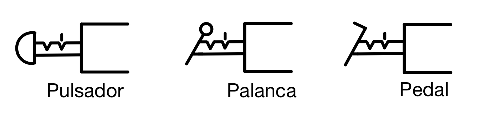{fig-align="center" width="509"}

## Identificación de una válvula distribuidora

La identificación de la válvula se define indicando los siguientes elementos:

* Dos cifras separadas por una barra (/), la primera indicando el número de vías y la segunda el número de posiciones.
* Tipo de accionamiento
* Tipo de retorno

Por ejemplo:

| Símbolo | Identificación |
|:-------:|:---------------|
| 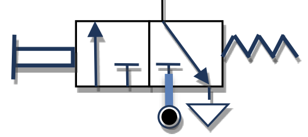{width="150"} | Válvula **3/2 monoestable** con **accionamiento manual** y **retorno** automático por **resorte** |
| 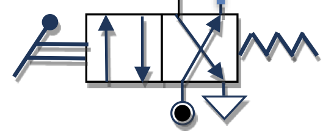{width="151"} | Válvula **4/2 monoestable** con **accionamiento por palanca** y **retorno** automático por **resorte** |
| 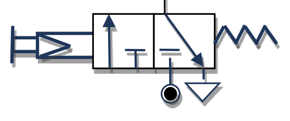{width="151"} | Válvula **3/2 monoestable** con **accionamiento manual servopilotado** y **retorno** automático por **resorte** |
| 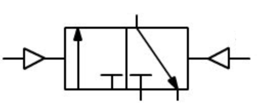{width="150"} | Válvula **3/2 biestable** con **accionamiento neumático** mediante **presión directa** |
| 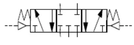{width="231"} | Válvula **5/3 monoestable** con **accionamiento neumático** mediante **presión directa** y **centrado** automático mediante **resorte** (posición central de bloqueo) |

# Válvulas de bloqueo

Son los componentes que bloquean o dejan pasar el caudal de aire por donde queramos y cuando queramos. Son las siguientes:

## Válvula antirretorno

Permite la circulación de aire comprimido en un solo sentido. En el dibujo permite el paso del aire izquierda a derecha.

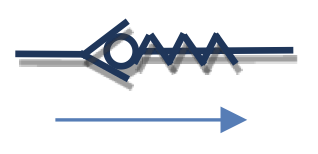{fig-align="center" width="151"}

## Válvula selectora o válvula "OR"

Permite la salida de aire cuando **al menos una** de las dos entradas tiene presión. No hay circulación de aire cuando en ninguna entrada hay presión.

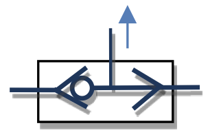{fig-align="center" width="150"}

## Válvula de simultaneidad o válvula "AND"

Permite la salida de aire **cuando las dos entradas disponen de presión**. No hay circulación si no hay presión en alguna entrada o en ambas.

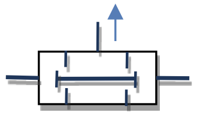{fig-align="center" width="150"}

## Válvula de escape rápido

Las válvulas de escape rápido (o liberación rápida) son válvulas que abren automáticamente el camino de salida a la atmósfera cuando cae la presión del aire en el camino de salida.

La tarea de estas válvulas es vaciar rápidamente las cámaras de los receptores neumáticos, por ejemplo, actuadores. Gracias a su uso, es posible aumentar significativamente la velocidad de movimiento del pistón actuador, especialmente de simple efecto.

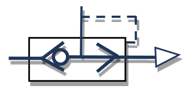{fig-align="center" width="149"}

# Válvulas de caudal

Son los componentes que regulan el caudal de aire que llega a los diferentes elementos del circuito. Los principales son:

## Válvula estranguladora unidireccional

Regula el caudal de aire en una sola dirección (mediante la apertura y cierre de un tornillo desde el valor $0$ hasta el máximo). En el otro sentido el aire circula libremente.

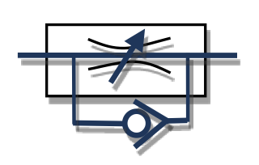{fig-align="center" width="151"}

La válvula del dibujo permite el paso libre del aire de derecha a izquierda y lo estrangula en sentido contrario.

## Válvula estranguladora bidireccional

Regula el caudal de aire en ambos sentidos.

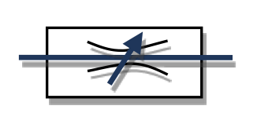{fig-align="center" width="151"}

## Temporizador

Se utiliza para retardar la llegada de aire y el accionamiento del cilindro. Combinan una válvula estranguladora unidireccional y un depósito de aire cuyo tiempo de llenado establece el retardo.

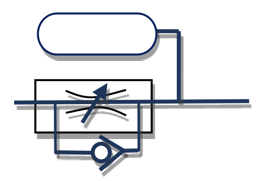{fig-align="center" width="200"}

Aquí puedes ver un ejemplo de uso de un temporizador:

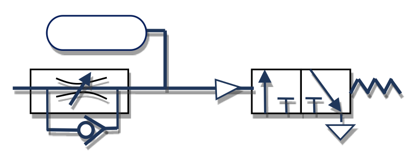{fig-align="center" width="400"}

::: {.callout-tip appearance="simple"}
El aire pasa por el estrangulamiento y va llenando el depósito lentamente. Hasta que el depósito no se llena por completo, la presión que llega a la válvula no es suficiente para accionarla, por lo que hay un retardo. Regulando el estrangulamiento podemos variar el tiempo de llenado del depósito y, por tanto, el retardo de la válvula 3/2.
:::