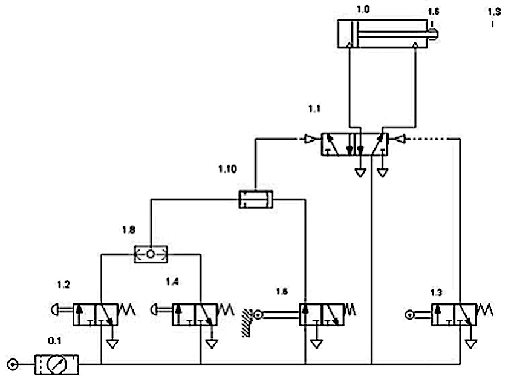
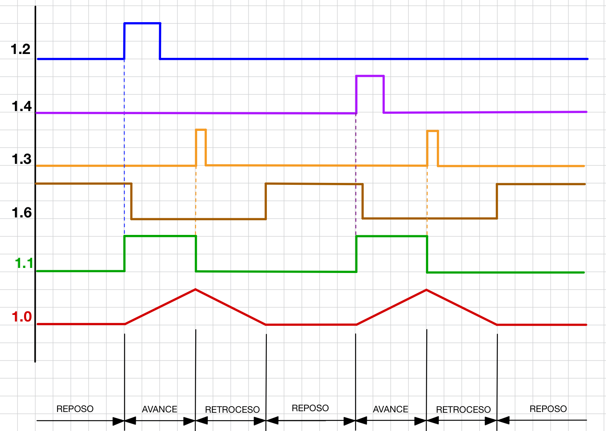
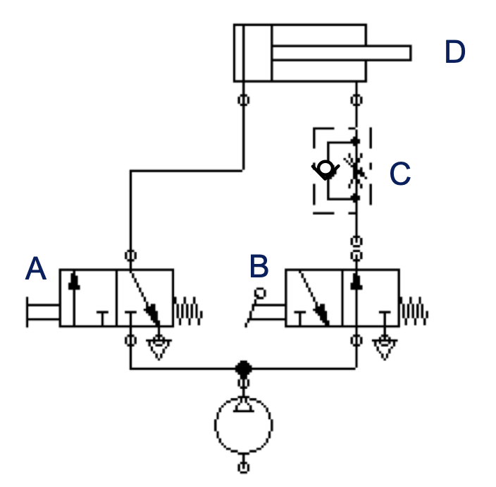
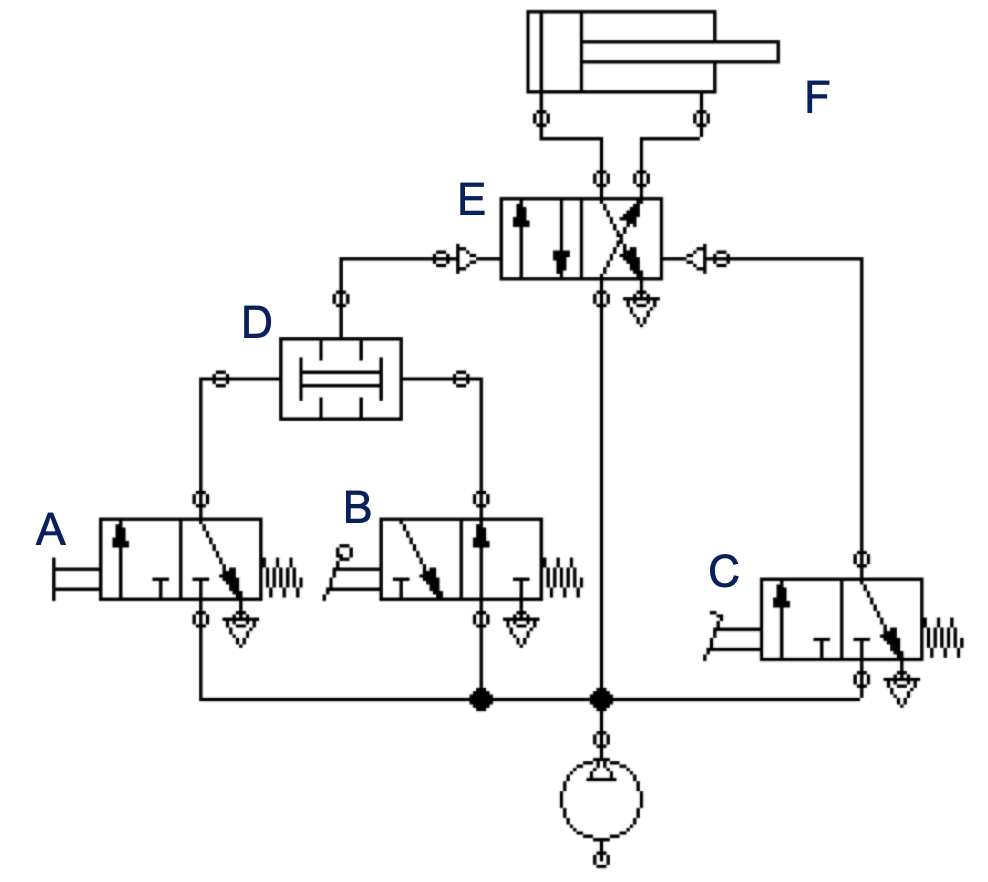
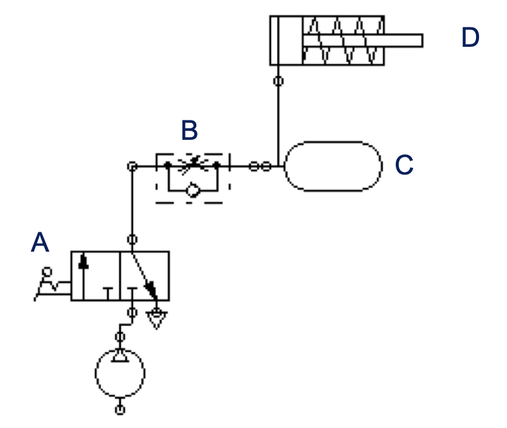
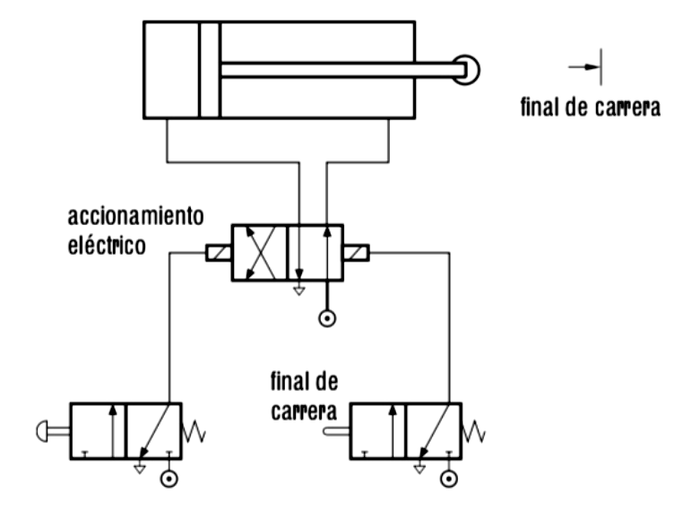
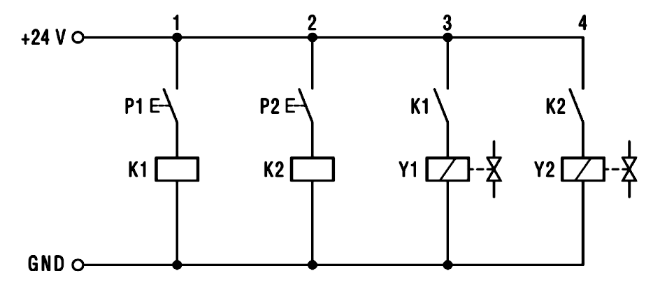
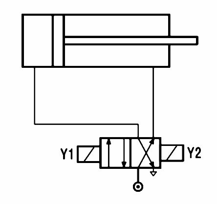

En este vídeo tienes un resumen de todos los componentes básicos de un circuito neumático. Nos servirá para recapitular y repasar todo lo estudiado. El circuito en sí consiste en controlar un cilindro de doble efecto con una válvula 5/2, pero es interesante por la explicación detallada que da de cada componente:



# Normalización en circuitos neumáticos {.text-success}

Cuando diseñamos un circuito neumático tenemos que pensar cómo conectar los diferentes elementos del circuito entre sí y dibujar el esquema del mismo. Los circuitos neumáticos se esquematizan utilizando la simbología que hemos ido viendo al estudiar los componentes por separado. Sin embargo, además de los símbolos, es muy importante la correcta **identificación** de los diferentes elementos en el circuito, así como su **distribución** dentro del esquema.

En este vídeo tienes las **normas más importantes** que hay que seguir a la hora de **diseñar** un circuito neumático:



# Análisis de circuitos neumáticos {.emphasis1}

Para analizar un circuito neumático dado, hay que seguir una serie de pasos. Los vamos a ver mediante un ejemplo para fijar ideas. Se trata de analizar el siguiente circuito neumático:

::: {.content-hidden when-format="pdf"}
{fig-align="center" width="700"}
:::

## 1. Identificar los elementos del circuito {.text-success}

Lo primero siempre es identificar los componentes del circuito, empezando por los receptores o actuadores. Hay que ser claro, escueto y sencillo a la hora de describir los elementos:

* **1.0.** Cilindro de doble efecto en la posición inicial con el vástago replegado.
* **1.1.** Válvula distribuidora 5/2, de pilotaje neumático.
* **1.2. y 1.4.** Válvulas de mando 3/2, monoestables, normalmente cerradas (NC), con pilotaje manual mediante pulsador y recuperación por resorte.
* **1.3. y 1.6.** Válvulas de mando 3/2, monoestables, normalmente cerradas (NC), con pilotaje mecánico por rodillo y recuperación por resorte.
* **1.8.** Válvula selectora (OR)
* **1.10.** Válvula de simultaneidad (AND)
* **0.1.** Equipo acondicionador de aire comprimido, formado por tres elementos, un filtro, un regulador y un lubricador (unidad FRL)

## 2. Describir el estado inicial del circuito {.text-success}

La **válvula AND 1.10 está bloqueada** porque solo le llega presión por uno de sus lados (desde la válvula 1.6, que se encuentra accionada en el instante inicial, ya que las demás válvulas de mando están bloqueadas).

La **válvula 1.3.** se encuentra en su posición de reposo NC, por lo que también está **bloqueada**.

Por lo tanto, **la válvula 5/2 permanece en reposo** (no le llega presión a ninguno de sus accionamientos) y el cilindro se encuentra retraído al recibir presión por su lado derecho.

## 3. Explicar lo que sucede a partir de la señal que desencadena el funcionamiento del circuito {.text-success}

El circuito inicia su funcionamiento **cuando se acciona cualquiera de las válvulas 1.2 o 1.4**.

Al accionar una de ellas, **la válvula OR se activa** y deja pasar presión hacia la válvula 1.10.

Como **la válvula 1.10** ya tenía presión en su otra entrada, **se activa** (ahora tiene las dos entradas presurizadas a la vez) y deja pasar presión para accionar la válvula 1.1

**La válvula 1.1. se acciona** al llegarle presión por su lado izquierdo y cambia de estado, haciendo que el aire a presión entre en el cilindro por la parte izquierda y la parte derecha quede abierta a la atmósfera. Por lo tanto, **el cilindro 1.0 realiza su carrera de avance**.

Cuando el cilindro 1.1 sale del todo, **activa el rodillo de la válvula 1.3,** lo que provoca el accionamiento de esta y que llegue aire a presión **por la derecha** a la válvula 1.1, provocando su accionamiento.

Al accionarse la **válvula 1.1** desde la derecha, **vuelve a su posición inicial**, haciendo que el aire a presión entre por la derecha del cilindro y comience la **retracción** de éste.

Al retraerse el cilindro, se **activa el rodillo de la válvula 1.6** y **el circuito queda de nuevo en su estado inicial de reposo** hasta que se vuelva a accionar manualmente alguna de las válvulas 1.2 o 1.4.

## 4. Dibujar los cronogramas de los elementos principales del circuito {.text-success}

Dibujamos los cronogramas para los casos en que se pulse 1.2 o se pulse 1.4:

{fig-align="center" width="700"}

# Ejercicios de análisis de circuitos neumáticos {.emphasis1}

Para cada uno de los siguientes circuitos, numera los diferentes elementos según normas y analiza su funcionamiento:

## Circuito 1 {.text-primary}

{fig-align="center" width="352"}

## Circuito 2 {.text-primary}

{fig-align="center" width="494"}

## Circuito 3 {.text-primary}

{fig-align="center" width="417"}

# Ejemplos
A continuación veremos una serie de circuitos básicos en neumática para entender su funcionamiento, lo que nos permitirá tener una idea clara de cómo diseñar circuitos neumáticos más complejos combinando estas técnicas básicas.

# Mando manual de cilindros con pulsadores {.emphasis1}

Vemos algunos ejemplos de control básico de cilindros mediante pulsadores:

## Cilindro de simple efecto con válvula 3/2 {.ex-accordion}

Este circuito básico consiste en controlar manualmente, mediante un pulsador, el funcionamiento de un cilindro de simple efecto. **Al pulsar, el cilindro sale y, al soltar, el cilindro se retrae**.

### Circuito con componentes



### Circuito con símbolos



## Cilindro de doble efecto con válvula 5/2 {.ex-accordion}

En este caso, al igual que en el anterior, se quiere que el cilindro **salga al pulsar el botón y se retraiga al soltarlo**. La diferencia es que, en esta ocasión, utilizamos un cilindro de doble efecto porque se necesitará realizar un trabajo importante también en el retroceso.

### Circuito con componentes



### Circuito con símbolos



## Control de un cilindro con dos pulsadores a la vez (válvula AND) {.ex-accordion}

En este caso queremos controlar el funcionamiento de un cilindro desde dos pulsadores. El cilindro sólo debe salir si pulsamos **los dos botones a la vez**. En cualquier otro caso, debe retraerse (o permanecer retraído).

### Circuito con componentes



### Circuito con símbolos



## Simulaciones interactivas {.text-success}

Aquí tienes algunos circuitos simples de ejemplo en un simulador online en el que puedes comprobar el funcionamiento de cada elemento:

* Cilindro de simple efecto:
  * [Control directo](http://www.logiclab.hu/lesson.php?fe=2)
  * [Control indirecto](http://www.logiclab.hu/lesson.php?fe=4)

* Cilindro de doble efecto:
  * [Control directo](http://www.logiclab.hu/lesson.php?fe=3)
  * [Control indirecto](http://www.logiclab.hu/lesson.php?fe=19)

* Lógica de control simple:
  * [AND mediante válvulas en serie](http://www.logiclab.hu/lesson.php?fe=21)
  * [Mediante válvula AND](http://www.logiclab.hu/lesson.php?fe=22)
  * [Mediante válvula OR](http://www.logiclab.hu/lesson.php?fe=9)

# Regulación de avance y retroceso de cilindros {.emphasis1}

En estos vídeos vas a ver ejemplos de cómo **controlar la velocidad de avance y retroceso de un cilindro utilizando válvulas reguladoras**.

## Para un cilindro de doble efecto {.ex-accordion}



## Para un cilindro de simple efecto {.ex-accordion}



# Funcionamiento automático con finales de carrera {.emphasis1}

Ahora vemos ejemplos de circuitos que funcionan de manera automática utilizando finales de carrera (válvulas que se accionan mediante rodillo).

## Movimiento intermitente de cilindro de doble efecto {.ex-accordion}

En este circuito tenemos una válvula que se acciona mediante pedal y que es la que inicia el funcionamiento. La válvula queda enclavada y, mientras está en ese estado, el cilindro va saliendo y entrando alternativamente, modificando su comportamiento él mismo al activar los rodillos A1 y A2 de las válvulas.

En el vídeo se puede ver el funcionamiento del circuito:



## Movimiento alternado de dos cilindros de doble efecto {.ex-accordion}

Este circuito se activa mediante una válvula de accionamiento por palanca y enclavamiento.

* Cuando se activa la palanca, el cilindro 1 avanza y luego se retrae automáticamente al activar el rodillo A1.
* Cuando acaba la retracción, activa A0 lo que provoca que el cilindro 2 avance.
* El cilindro 2 funciona de forma análoga al 1: se retrae automáticamente al activar el rodillo B1 y, al acabar la carrera de retroceso, activa B0, lo que provoca que avance el cilindro 1.
* El proceso se mantiene repitiéndose indefinidamente hasta que volvamos a accionar la palanca (la soltamos del enclavamiento) y se bloquea el paso de aire al cilindro 1.

En este vídeo puedes ver el funcionamiento:



# Control eléctrico {.emphasis1}

## Avance por pulsador y retroceso automático {.ex-accordion}

En el circuito neumático de la siguiente figura, utilizamos una válvula de accionamiento y retorno eléctrico, que gobierna un cilindro de doble efecto. Éste avanza su émbolo por medio del accionamiento del pulsador de la válvula de la izquierda. Una vez alcanza su posición final, retrocede por medio de un final de carrera colocado en el recorrido del vástago, que acciona a su vez la válvula de la derecha.

{fig-align="center" width="401"}

## Cilindro de doble efecto controlado por dos pulsadores eléctricos {.ex-accordion}

Queremos que, al accionar el primer pulsador P1, se produzca completamente la salida del vástago. El retroceso del vástago se producirá al accionar el segundo pulsador eléctrico P2.

La solución es plantea mediante el **mando indirecto**, con dos pulsadores que activan dos relés eléctricos. El funcionamiento es el siguiente:

* Al accionar el pulsador P1, el circuito eléctrico se cierra y se activa el relé K1. Un contacto abierto del relé K1 hace que la bobina Y1 de la electroválvula se active y esto provoca que el vástago del cilindro salga.
* Tras llegar el cilindro al final de su recorrido, permanecerá en esa posición hasta que actuemos sobre el pulsador P2;
* Al accionar P2, se activará el relé K2 y un contacto abierto de éste se cerrará, con lo que se activará la bobina Y2 de la electroválvula y esto producirá que el cilindro efectúe su movimiento de recogida.

### Circuito eléctrico

{fig-align="center" width="500"}

### Circuito neumático

{fig-align="center" width="250"}

