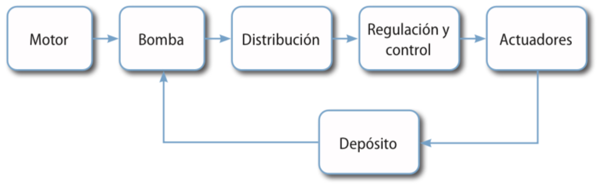
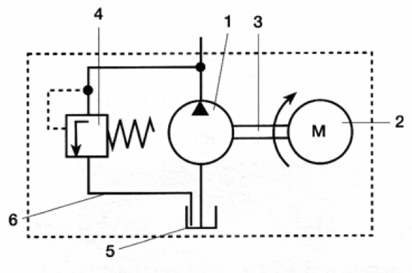
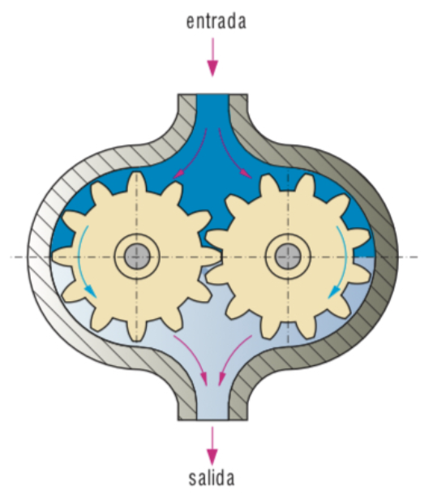
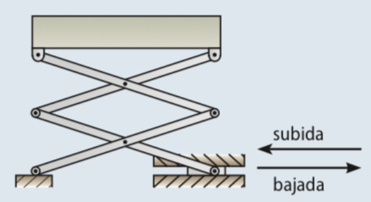
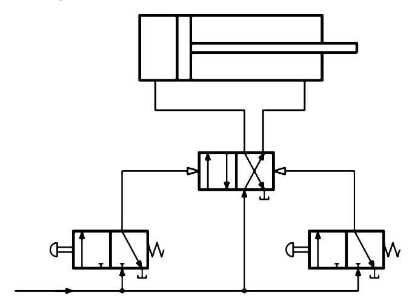
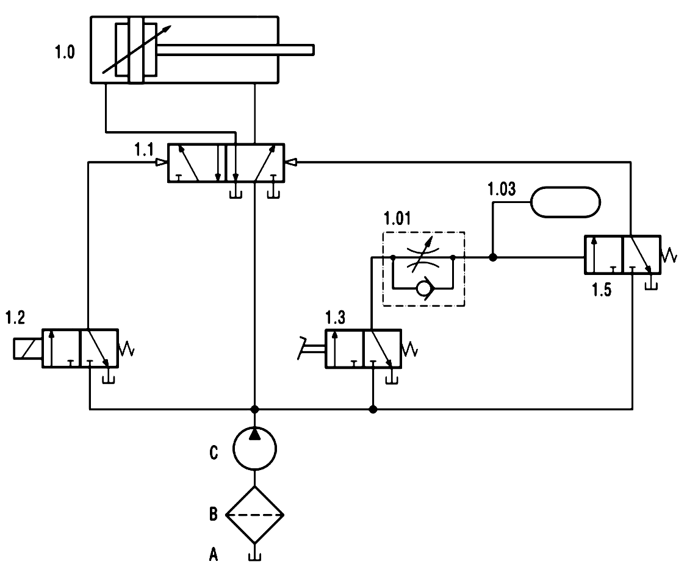

## Introducción

Los sistemas hidráulicos emplean como fluido un líquido, lo que permite intensificar las fuerzas de trabajo. Como hemos visto, emplean aceite mineral, por eso también se llaman oleohidráulicos.

A grandes rasgos, podemos decir que la hidráulica se usa allí donde se requiere alguna de estas tres cosas:

*   Transmisión de grandes fuerzas.
*   Velocidades lentas.
*   Detención de cilindros en un punto intermedio del recorrido, con precisión.

Por ejemplo, en la maquinaria de gran potencia, como es el caso de los brazos hidráulicos de las grúas, el accionamiento del tren de aterrizaje de los aviones o el freno y el embrague de los vehículos.

## Diferencias fundamentales entre neumática e hidráulica

La simbología de los diferentes elementos de un circuito hidráulico es prácticamente la misma que la que hemos visto para los elementos neumáticos. Aun así, los circuitos hidráulicos son muy diferentes de los neumáticos.

En esta tabla resumimos las diferencias fundamentales entre ambas tecnologías:

| NEUMÁTICA                                                     | HIDRÁULICA                                                        |
| :------------------------------------------------------------- | :---------------------------------------------------------------- |
| Mayor velocidad de respuesta y operación                      | Menor velocidad de respuesta y operación                          |
| Más económicos para usos de poca fuerza                        | Más costosos                                                      |
| Más versátiles                                                | Menos versátiles                                                  |
| Menos contaminantes                                           | Más contaminantes                                                 |
| Muy utilizados en automatización de procesos productivos       | Prácticamente no se utilizan en automatización de procesos productivos |
| No se pueden usar en aplicaciones de alta fuerza (cargas por debajo de los 3000 kg) | Manejan cargas elevadas tanto en actuadores lineales como en motores de par elevado. |
| No necesitan sistemas especiales de refrigeración            | Requiere de sistemas de enfriamiento de aceite adicionales.       |
| Desplazamientos rápidos y motores de alta velocidad            | Control exacto de la velocidad y parada                           |
| Producen mucho ruido y vibraciones                             | Funcionamiento suave y silencioso                                 |
| Utiliza como fluido aire a presión, 6-10 bares.              | Utiliza como fluido aceite “oleohidráulico” a presiones de hasta más de 200 bares. |

## Movimiento del fluido. Bombas hidráulicas

Los componentes de los circuitos hidráulicos son similares a los de los circuitos neumáticos; se diferencian principalmente en que la función del compresor la realiza una **bomba**.

También difieren en que hay un **circuito de retorno del aceite al depósito** desde los puntos de escape y en que se trata de **circuitos cerrados**.

::: {.center}

:::

### Grupo de accionamiento

Al conjunto de elementos que generan la presión en el fluido se le conoce como "Grupo de accionamiento". Se suele representar dentro de un marco de línea discontinua:

::: {.center}

:::
Los elementos del grupo son:

1.  Bomba hidráulica
2.  Motor eléctrico
3.  Eje
4.  Válvula limitadora de presión
5.  Depósito
6.  Tuberías

### Bomba hidráulica

Las bombas hidráulicas tienen la función de tomar aceite a una determinada presión y elevarla hasta la presión de trabajo.

En la figura se representa una bomba hidráulica de engranajes:

::: {.center}

:::

Consta de dos ruedas dentadas idénticas, una de las cuales, movida por un motor, hace que gire la otra. El movimiento genera una depresión en la cámara unida al depósito que aspira el fluido. Entonces éste es transportado a través de los dientes del engranaje hasta llegar al orificio de salida de la bomba, donde es impulsado.

## Ejemplos de circuitos hidráulicos

Las diferencias fundamentales entre el esquema de un circuito hidráulico respecto de un circuito neumático son:

*   En un circuito hidráulico tendremos el símbolo de una bomba y un filtro (o del grupo de accionamiento completo) en vez del punto de presión o compresor y unidad FRL.
*   En un circuito neumático los escapes van directamente hacia el exterior, mientras que en el hidráulico van siempre al depósito de aceite.

Por lo demás, son prácticamente iguales, por lo que este par de ejemplos serán muy sencillos de entender después de todo lo aprendido en circuitos neumáticos:

### Plataforma elevadora hidráulica

Podemos elevar una plataforma mediante la acción de un cilindro si utilizamos un mecanismo como este:

::: {.center}

:::

El circuito para manejar ese cilindro es fácil después de lo que ya hemos visto en neumática. Aquí puedes ver su esquema:

::: {.center}

:::

El pulsador de la izquierda impulsa la bajada de la plataforma. La válvula 3/2 de la izquierda cambia de posición respecto a la situación de reposo y permite el paso del aceite desde al bomba hasta la válvula 4/2. La válvula 4/2, accionada por el fluido a presión, permite el paso a la cámara izquierda del cilindro, que desplazará el vástago hacia al derecha, lo cual producirá que el mecanismo articulado baje al plataforma.

De forma análoga, al accionar el pulsador de subida, la válvula de la derecha cambia de posición y permite el paso del fluido hasta la válvula 4/2. Al cambiar esta válvula, llena de fluido la cámara derecha del cilindro, lo cual produce el movimiento del vástago hacia la izquierda, la elevación de al plataforma y, por último, el paso del fluido hasta el depósito.

### Avance mediante electroválvula y retroceso retardado mediante pedal

El esquema del circuito es el siguiente:

::: {.center}

:::

El funcionamiento del circuito es así:

*   Al accionar la válvula 1.2 (electroválvula), el fluido llega a la válvula 1.1, que cambia de posición, con lo que entra líquido en el cilindro y se produce el avance del vástago.
*   Cuando accionamos mediante el pedal la válvula 1.3 (mantenemos el pedal pulsado), y tras un tiempo establecido en la válvula temporizadora, la válvula 1.5 provoca que la válvula 1.1 cambie de posición y el vástago del cilindro retroceda.
*   Si soltamos el pedal antes de que se cumpla el tiempo establecido, la válvula 1.5 no se accionará y el vástago del cilindro se mantendrá en su posición de avance.