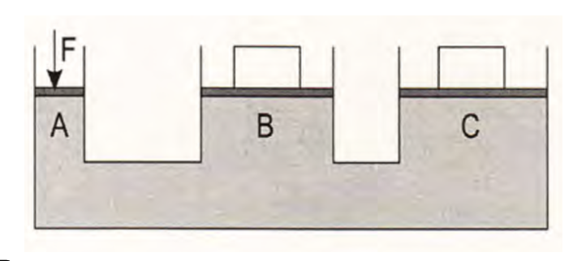

::: {.content-visible when-format="html"}
::: {.callout-tip appearance="simple"}
## 📥 Material Original
[Descargar PAU Hidráulica (PDF)](media/EJERCICIOS_PAU_HIDRAULICA.pdf) | [Descargar PAU Cilindros (PDF)](media/EJERCICIOS_PAU_CILINDROS.pdf)
:::
:::

# Bloque 1: Hidráulica

## 2014-2015

1. Por una tubería horizontal circula un líquido de $900 \text{ kg/m}^3$ de densidad a una velocidad de $1,40 \text{ m/s}$. La sección transversal de la tubería es de $10 \text{ cm}^2$ y la presión es de $0,12 \text{ MPa}$. En la tubería existe un estrechamiento en el que la presión desciende a $0,10 \text{ MPa}$. Se pide:
   a) El caudal de circulación del fluido.
   b) La velocidad del fluido en el estrechamiento y el diámetro del mismo.

2. Por una tubería de $2 \text{ cm}$ de diámetro circula agua con una velocidad de $60 \text{ m/min}$. Se pide:
   a) El caudal de agua que circula por dicha tubería en unidades del S.I.
   b) El régimen de circulación si la viscosidad dinámica y la densidad del agua son $0,087 \text{ Pa}\cdot\text{s}$ y $1000 \text{ kg/m}^3$, respectivamente.

3. En una estación de tratamiento de agua potable se bombea agua por una tubería de $30 \text{ mm}$ de diámetro a una velocidad de $4 \text{ m/s}$. Se pide:
   a) El caudal de agua en $\text{l/min}$.
   b) Determinar la velocidad en otra sección de la tubería de $20 \text{ mm}$ de diámetro.

4. Por una tubería de $0,95 \text{ cm}$ de diámetro circula aceite con un caudal de $0,177 \text{ l/s}$ y una presión de $500 \text{ MPa}$. Se pide:
   a) La velocidad de circulación del aceite.
   b) La potencia de la bomba de la instalación suponiendo un rendimiento del $80\%$.

5. Por una tubería horizontal de $5 \text{ cm}$ de diámetro circula un líquido de densidad $1,15 \text{ g/cm}^3$ a una velocidad de $8 \text{ cm/s}$, registrándose una presión manométrica de $1,5 \text{ kp/cm}^2$. La tubería se estrecha hasta tener $2 \text{ cm}$ de diámetro. Se pide:
   a) Hacer un dibujo representativo de la situación considerada y calcular el caudal en unidades del S.I.
   b) Determinar la velocidad y la presión absoluta en la sección estrecha de la tubería en unidades del S.I. si la presión atmosférica es de $10^5 \text{ Pa}$.

6. En una fábrica de lubricantes para automoción, un aceite mineral es transportado para su almacenamiento por una conducción de $4 \text{ cm}$ de diámetro, a una velocidad de $0,3 \text{ m/s}$ y una presión de trabajo de $9 \text{ MPa}$. La densidad y viscosidad cinemática del aceite son $0,85 \text{ kg/dm}^3$ y $2 \text{ cm}^2/\text{s}$, respectivamente. Se pide:
   a) El caudal que circula por la tubería expresado en $\text{dm}^3/\text{min}$ y la potencia total de la bomba, suponiendo un rendimiento del $87\%$.
   b) Determinar el régimen de circulación del aceite.

## 2015-2016

7. Por una tubería horizontal de $4 \text{ cm}$ de diámetro circula un caudal de $200 \text{ dm}^3/\text{min}$ de un fluido hidráulico cuya densidad es $925 \text{ kg/m}^3$. La tubería tiene un estrechamiento con un diámetro de $25 \text{ mm}$. Se pide:
   a) La velocidad del fluido en los dos tramos de la tubería en $\text{m/s}$.
   b) El régimen de circulación sabiendo que la viscosidad dinámica es $0,006 \text{ N}\cdot\text{s/m}^2$.

8. La bomba de un circuito hidráulico aporta un caudal de $30 \text{ dm}^3/\text{min}$ de aceite por una tubería de $2,5 \text{ cm}$ de diámetro a una presión de $50 \text{ kp/cm}^2$. El aceite utilizado tiene, a la temperatura de trabajo, una densidad de $0,85 \text{ g/cm}^3$ y una viscosidad dinámica de $0,55 \cdot 10^{-3} \text{ Pa}\cdot\text{s}$. El rendimiento de la bomba es del $75\%$. Se pide:
   a) El régimen de circulación del líquido por la tubería.
   b) La potencia de la bomba en vatios.

9. Un camión cisterna transporta $20 \text{ m}^3$ de gasoil. Posee una bomba de vaciado que funciona a $12 \text{ MPa}$ de presión con un caudal de $15 \text{ dm}^3/\text{s}$. La manguera que se utiliza tiene un diámetro de $20 \text{ cm}$. Se pide:
   a) El tiempo de vaciado y la velocidad a la que circula el gasoil dentro de la manguera.
   b) La potencia absorbida por la bomba si tiene un rendimiento del $85\%$.

10. En una prensa hidráulica la fuerza ejercida en el émbolo menor es $5 \text{ N}$. Se sabe que el radio del émbolo mayor es tres veces el radio del menor. Se pide:
    a) La fuerza obtenida en el émbolo mayor.
    b) El desplazamiento del émbolo mayor si el pequeño se ha desplazado un metro.

## 2016-2017

11. Por una tubería horizontal de $2$ pulgadas de diámetro ($1 \text{ pulgada} = 2,54 \text{ cm}$) circula agua con un caudal de $60 \text{ litros por minuto}$. A la temperatura de operación, la viscosidad del agua es $0,087 \text{ N}\cdot\text{s/m}^2$ y la densidad $1 \text{ g/cm}^3$. El agua se destina a llenar un depósito de sección circular de $10 \text{ m}$ de diámetro.
    a) Determine el régimen de circulación del líquido por la tubería.
    b) Calcule el tiempo que ha de transcurrir para que el nivel del depósito se eleve $2 \text{ m}$.

12. Sobre la compuerta de desagüe de una prensa el agua embalsada ejerce una fuerza de $1250 \text{ N}$. La compuerta tiene $2 \text{ m}$ de diámetro y al abrirla, el caudal de desagüe es $15 \text{ m}^3/\text{s}$.
    a) Calcule la velocidad de salida del agua por el desagüe.
    b) Calcule la presión sobre la compuerta cuando está cerrada.

13. Un grupo de presión bombea agua por una tubería horizontal de $30 \text{ mm}$ de diámetro con una velocidad de $4 \text{ m/s}$.
    a) Calcule el caudal de agua en litros por minuto.
    b) Determine la velocidad en un estrechamiento de la tubería cuyo diámetro es $20 \text{ mm}$.

14. Una tubería horizontal de $180 \text{ mm}$ de diámetro conduce agua con una velocidad de $10 \text{ m/s}$ a una presión de $60 \text{ kPa}$. En un punto de la tubería existe un estrechamiento donde la presión se reduce a $12 \text{ kPa}$. La densidad del agua es $1000 \text{ kg/m}^3$.
    a) Calcule la velocidad del agua en el estrechamiento.
    b) Calcule el diámetro del estrechamiento.

15. Una prensa hidráulica consta de dos émbolos cuyos diámetros son $8 \text{ cm}$ y $25 \text{ cm}$. Sobre el émbolo de menor diámetro se aplica una carga de $100 \text{ kp}$.
    a) Calcule el peso, expresado en $\text{N}$, que se puede elevar en el émbolo de mayor diámetro.
    b) Si se quiere elevar $50 \text{ cm}$ la carga situada en el émbolo de mayor diámetro, determine el recorrido total del émbolo pequeño.

## 2017-2018

16. Los dos pistones de una prensa hidráulica tienen por sección: $A_1 = 5 \text{ cm}^2$ y $A_2 = 200 \text{ cm}^2$. La fuerza aplicada perpendicularmente a la sección menor es $98 \text{ N}$. Se pide:
    a) Dibuje un esquema de la prensa y calcule el peso que podrá levantar.
    b) Obtenga el desplazamiento del pistón mayor cuando el pistón pequeño baja $0,1 \text{ m}$.

17. Los émbolos de una prensa hidráulica tienen $2 \text{ cm}$ y $16 \text{ cm}$ de diámetro. Con esta máquina un operario desea elevar a una altura de un metro una carga de $2 \cdot 10^4 \text{ N}$.
    a) Calcule la fuerza que será necesario aplicar en el émbolo pequeño.
    b) Determine el desplazamiento total que se ha producido en el émbolo pequeño. Si la carrera del cilindro es de $8 \text{ cm}$, determine el número de emboladas necesarias para conseguir el desplazamiento total.

18. Por una tubería horizontal de $5 \text{ cm}$ de diámetro circula un líquido con densidad $0,96 \text{ g/cm}^3$ y con un caudal de $30 \text{ l/min}$. La tubería tiene un estrechamiento y la diferencia de las presiones medidas en ambas secciones es $2 \cdot 10^4 \text{ Pa}$.
    a) Calcule en la parte ancha de la tubería, la sección y la velocidad a la que circula el líquido.
    b) Determine en la parte estrecha de la tubería, la velocidad a la que circula el líquido y el diámetro que tiene este tramo.

19. Un líquido circula por una tubería horizontal de $20 \text{ mm}$ de diámetro a una velocidad de $3 \text{ m/s}$. La tubería cambia de sección en un punto dado de la instalación a un diámetro de $10 \text{ mm}$.
    a) Calcule el caudal en la tubería expresándolo en $\text{dm}^3/\text{min}$.
    b) Determine la velocidad del fluido en la sección menor.

20. En una fábrica de reciclaje industrial se desea bombear aceite por una tubería a una velocidad de $15 \text{ m/s}$ y a una presión de trabajo de $10 \text{ MPa}$. El diámetro de la tubería es $1,2 \text{ cm}$. Considere que la densidad y viscosidad cinemática del aceite son $0,95 \text{ kg/l}$ y $1,85 \text{ cm}^2/\text{s}$, respectivamente.
    a) Determine el caudal por la tubería, expresado en $\text{l/min}$, y la potencia absorbida, si el rendimiento es del $78\%$.
    b) Calcule e indique el régimen de circulación del aceite.

21. Un coche de una tonelada de masa se apoya en sus cuatro ruedas con una superficie de $50 \text{ cm}^2$ por cada rueda. El coche se eleva en un taller con un gato hidráulico donde los diámetros del émbolo menor y mayor de la prensa hidráulica son $10$ y $50 \text{ cm}$, respectivamente.
    a) Calcule la fuerza que hay que ejercer sobre el émbolo menor para levantar el coche.
    b) Calcule la presión que ejerce el coche sobre el suelo.

## 2018-2019

22. Se observa que un grifo de agua de una casa tarda $50 \text{ s}$ en llenar una garrafa de $5 \text{ l}$ de capacidad. Las tuberías de la casa tienen un diámetro de $18 \text{ mm}$ y la boca del grifo tiene un diámetro de $1 \text{ cm}$ (densidad del agua $1000 \text{ kg/m}^3$).
    a) Calcule la velocidad del agua dentro de la tubería y en la boca del grifo.
    b) Obtenga la presión manométrica dentro de la tubería, teniendo en cuenta que la presión en la boca del grifo es la atmosférica.

23. Por la parte ancha de un tubo de Venturi circula un líquido a una velocidad de $4 \text{ m/s}$. La diferencia de presión entre la parte ancha y estrecha del tubo es $7,2 \cdot 10^4 \text{ Pa}$. La sección de la parte estrecha es $5 \text{ cm}^2$ y la densidad del líquido es $0,81 \text{ g/cm}^3$.
    a) Determine la velocidad del líquido en el estrechamiento.
    b) Obtenga el caudal del líquido que circula por el tubo y la sección de la parte ancha del mismo.

24. En una prensa hidráulica como la de la figura los émbolos A, B y C tienen una superficie de $500 \text{ mm}^2$, $60 \text{ cm}^2$ y $70 \text{ cm}^2$, respectivamente. La fuerza ejercida en el émbolo menor es $50 \text{ N}$.
    {width="400"}{align="center"}
    a) Calcule las cargas que se pueden elevar en cada émbolo.
    b) A continuación se cambian las secciones de los émbolos B y C, manteniendo igual la sección y la fuerza ejercida sobre el émbolo A. Calcule las fuerzas resultantes en B y C, sabiendo que la fuerza en B es tres veces superior a la de C, y la suma de ambas vale $2000 \text{ N}$. Determine también cuáles deben ser las nuevas secciones de los émbolos B y C.

25. El grifo de llenado de la piscina de una casa aporta un caudal de agua de $3 \text{ l/s}$. La piscina es cuadrada de $5 \text{ metros}$ de lado y tiene una profundidad de $1,5 \text{ m}$.
    a) Calcule el tiempo que tarda en llenarse la piscina con el grifo.
    b) Para acelerar el llenado de la piscina, se aporta también agua a $150 \text{ kPa}$ de presión mediante una bomba de $1,1 \text{ kW}$ (que funciona con un rendimiento del $100\%$). Determine el caudal que aporta la bomba y el nuevo tiempo de llenado con los dos suministros funcionando desde el principio.

26. Un sistema oleohidráulico consta de una bomba que proporciona una presión de trabajo de $8 \text{ MPa}$ al circuito. El diámetro de la tubería es $10 \text{ mm}$ y la velocidad del fluido $2,85 \text{ m/s}$. La densidad del aceite es $0,9 \text{ kg/l}$ y su viscosidad cinemática $1,72 \text{ cm}^2/\text{s}$.
    a) Obtenga el caudal y la potencia absorbida por la bomba si tiene un rendimiento del $80\%$.
    b) Determine el régimen de circulación del fluido.

27. Una tubería horizontal consta de dos tramos de diferente sección. Por el tramo ancho de $15 \text{ cm}$ de diámetro circula agua a una velocidad de $5,5 \text{ m/s}$. El tramo estrecho tiene un diámetro de $6 \text{ cm}$. La densidad del agua es $1 \text{ g/cm}^3$.
    a) Calcule el caudal y la velocidad a la que circula el líquido por el tramo estrecho de la conducción.
    b) Obtenga la diferencia de presión entre ambos tramos. Exprese el valor en $\text{N/m}^2$.

# Bloque 2: Neumática (Cilindros)

## 2014-2015

1. Un cilindro de doble efecto tiene un émbolo de $90 \text{ mm}$ de diámetro y un vástago de $20 \text{ mm}$ de diámetro. Se conecta a una red de aire comprimido y ejerce una fuerza en el avance de $10000 \text{ N}$. Se pide:
    a) Presión de la red de aire comprimido.
    b) Fuerza que ejerce en el retroceso.

2. Un cilindro de doble efecto ejerce una fuerza máxima de $10000 \text{ N}$ y tiene una carrera de $20 \text{ cm}$. Se pide:
    a) El diámetro que debe tener el vástago para que la tensión en el mismo no supere los $8 \text{ MPa}$ al ejercer la fuerza máxima.
    b) El diámetro del émbolo teniendo en cuenta que el consumo de aire, medido a la presión de trabajo, es de $3 \text{ litros}$ por ciclo.

3. Una instalación neumática dispone de tres cilindros idénticos de doble efecto de $12 \text{ cm}$ de diámetro de émbolo, $2 \text{ cm}$ de diámetro de vástago y $25 \text{ cm}$ de carrera. Los cilindros realizan cada hora $60$, $30$ y $15$ ciclos, respectivamente. Las pérdidas por rozamiento son nulas y la presión de trabajo es de $6 \text{ bares}$. Se pide:
    a) Fuerza de avance y retroceso de cada cilindro.
    b) Caudal de aire en condiciones normales que necesita la instalación para su funcionamiento.

4. Un cilindro neumático de doble efecto tiene las siguientes características: diámetro del émbolo $50 \text{ mm}$, diámetro del vástago $10 \text{ mm}$, presión de trabajo $6 \text{ bares}$, pérdidas por rozamiento $10\%$ de la fuerza teórica. Se pide:
    a) La fuerza que ejerce en el avance.
    b) La fuerza que ejerce en el retroceso.

5. Un cilindro neumático de doble efecto tiene las siguientes características: presión de trabajo $8 \cdot 10^5 \text{ N/m}^2$, diámetro del cilindro $60 \text{ mm}$, diámetro del vástago $20 \text{ mm}$ y pérdidas por rozamiento $4\%$ de la fuerza teórica. Se pide:
    a) Calcular la fuerza que ejerce el vástago en el avance.
    b) Calcular la fuerza que ejerce el vástago en el retroceso.

6. Un cilindro de simple efecto consume en cada ciclo de funcionamiento un volumen de aire de $500 \text{ cm}^3$ medidos a la presión de trabajo. La carrera del émbolo es de $20 \text{ cm}$. La presión de trabajo es de $9 \text{ kp/cm}^2$ y la presión atmosférica es $1 \text{ kp/cm}^2$. El cilindro completa $20$ ciclos cada minuto. Se pide:
    a) El diámetro del cilindro en $\text{cm}$ y la fuerza de avance en $\text{kp}$.
    b) El volumen de aire en $\text{m}^3$ consumidos en condiciones normales en un minuto de funcionamiento.

## 2015-2016

7. Se dispone de un cilindro hidráulico de doble efecto de $500 \text{ mm}$ de carrera, $100 \text{ mm}$ de diámetro del émbolo y $45 \text{ mm}$ de diámetro del vástago alimentado por una bomba que proporciona una presión de $60 \text{ bares}$ y un caudal de $10 \text{ dm}^3/\text{min}$. Se pide:
    a) La fuerza de avance y de retroceso del vástago.
    b) Las velocidades de avance y retroceso del émbolo.

8. En un cilindro de simple efecto se conocen los siguientes datos: diámetro del émbolo $40 \text{ mm}$, diámetro del vástago $12 \text{ mm}$, presión de trabajo $600 \text{ kPa}$, pérdidas por rozamiento $12\%$ y fuerza de recuperación del muelle $6\%$. Se pide:
    a) La fuerza teórica y la fuerza neta en el avance.
    b) La fuerza de retroceso si el muelle se comprime $102,8 \text{ mm}$ y su constante elástica es $500 \text{ N/m}$.

9. Un cilindro neumático de doble efecto, con un émbolo de $20 \text{ mm}$ de diámetro y un vástago de $12 \text{ mm}$ de diámetro, realiza una carrera de $45 \text{ mm}$ a un régimen de trabajo de $15 \text{ ciclos/min}$. Se pide:
    a) El caudal de aire consumido en condiciones de trabajo, expresado en $\text{m}^3/\text{min}$.
    b) El caudal si el cilindro fuese de simple efecto y su comparación con el caudal anterior. ¿A qué se debe la diferencia?

10. Un cilindro neumático de simple efecto tiene un émbolo de $50 \text{ mm}$ de diámetro y proporciona una fuerza de empuje de $1000 \text{ N}$ para elevar una carga. Las pérdidas por rozamiento y las debidas al muelle recuperador son el $10\%$ y el $6\%$, respectivamente, de la fuerza de empuje. Se pide:
    a) El valor de las pérdidas totales del cilindro.
    b) La presión del aire comprimido que alimenta este cilindro.

11. Se dispone de un cilindro neumático de simple efecto que tiene un émbolo de $63 \text{ mm}$ de diámetro. La presión de trabajo es $6 \text{ bares}$ y la carrera del pistón $10 \text{ cm}$. La fuerza neta ejercida por el vástago del cilindro es el $90\%$ de la fuerza teórica. Se pide:
    a) La fuerza neta ejercida por el cilindro en su movimiento de avance.
    b) El consumo de aire medido en condiciones normales en una hora si este cilindro completa $6$ ciclos de trabajo cada minuto.

12. Una máquina neumática dispone de dos cilindros iguales de simple efecto de $7 \text{ cm}$ de diámetro y una carrera de $100 \text{ mm}$, realizando los siguientes ciclos de trabajo: el cilindro A, un ciclo cada $2$ segundos y el cilindro B, un ciclo cada segundo. Se pide:
    a) El caudal de aire en $\text{dm}^3/\text{min}$ de cada cilindro a la presión de trabajo.
    b) La potencia desarrollada por cada cilindro si la presión de trabajo es $6 \text{ bares}$.

## 2016-2017

13. Un cilindro neumático de simple efecto es accionado con aire comprimido. El diámetro del émbolo es $25 \text{ mm}$, la carrera del pistón $50 \text{ mm}$ y la presión de trabajo $6 \text{ bares}$. Las fuerzas de rozamiento y de retorno del muelle representan el $4\%$ y el $8\%$, respectivamente, de la fuerza teórica de avance del émbolo.
    a) Calcule la fuerza neta ejercida por el vástago en el movimiento de avance.
    b) Si este cilindro completa $10$ ciclos de trabajo cada minuto, calcule el consumo de aire en condiciones normales expresado en litros por hora.

14. El volumen de aire desplazado por el émbolo de un cilindro de doble efecto, en un ciclo completo, es $2 \text{ litros}$ medido a la presión de trabajo. La fuerza teórica en la carrera de avance es $16000 \text{ N}$ y la presión de trabajo $0,5 \text{ MPa}$. La fuerza de rozamiento es el $10\%$ de la fuerza teórica. El diámetro del vástago es $25 \text{ mm}$.
    a) Calcule el diámetro del émbolo.
    b) Determine la carrera del émbolo.

15. Un cilindro de simple efecto que trabaja a una presión de $250 \text{ kg/cm}^2$ con un rendimiento del $85\%$, tiene las siguientes características: diámetro $6 \text{ cm}$, diámetro del vástago $3 \text{ cm}$ y carrera $18 \text{ cm}$. El vástago se mueve a razón de $5$ ciclos por minuto y la fuerza del muelle es un $6\%$ de la fuerza teórica.
    a) Calcule la fuerza efectiva de avance del vástago.
    b) Calcule el consumo de aire en las condiciones de trabajo expresado en $\text{m}^3/\text{s}$.

16. Un cilindro de simple efecto de retorno por muelle realiza trabajo por compresión en una prensa. El cilindro está conectado a una red de aire de $2 \text{ MPa}$ de presión, siendo el diámetro del émbolo $14 \text{ cm}$ y su carrera $6 \text{ cm}$. La constante del muelle es $120 \text{ N/cm}$ y la fuerza de rozamiento el $10\%$ de la teórica.
    a) Calcule la fuerza de avance al final de la carrera.
    b) Determine el consumo de aire en las condiciones de trabajo si efectúa $10$ ciclos por minuto. Exprese el resultado en litros por minuto.

17. Para la apertura o cierre de una puerta se utiliza un cilindro ideal de doble efecto. Se conocen los siguientes datos: diámetro del émbolo $10 \text{ cm}$, diámetro del vástago $3 \text{ cm}$ y carrera $12 \text{ cm}$. Este cilindro se conecta a una red de aire comprimido de $2 \text{ MPa}$ de presión.
    a) Calcule la fuerza que ejerce el vástago en la carrera de avance y en la de retorno.
    b) Calcule el consumo de aire en condiciones normales en un ciclo.

18. Un cilindro neumático vertical de simple efecto con retroceso por gravedad (sin muelle), debe elevar una carga total de $50 \text{ kp}$ (incluida la necesaria para vencer el rozamiento), realizando $12$ maniobras por minuto a una presión de trabajo de $0,7 \text{ MPa}$.
    a) Calcule el diámetro del cilindro.
    b) Determine el consumo de aire a la presión de trabajo si la carrera es $500 \text{ mm}$.

19. Un cilindro de doble efecto tiene un émbolo de $90 \text{ mm}$ de diámetro, un vástago de $28 \text{ mm}$ de diámetro y una carrera de $420 \text{ mm}$. El cilindro realiza $20$ ciclos cada minuto a una presión de trabajo de $5 \text{ bares}$.
    a) Calcule las fuerzas de avance y retroceso.
    b) Determine el consumo de aire del cilindro en condiciones normales expresado en litros por minuto.

## 2017-2018

20. Un cilindro de simple efecto de retorno por muelle se encuentra conectado a una red de aire de $1,1 \text{ MPa}$ de presión. La constante del muelle es $120 \text{ N/cm}$, el diámetro del émbolo es $12 \text{ cm}$, su carrera $4 \text{ cm}$ y la fuerza de rozamiento el $15\%$ de la teórica.
    a) Calcule la fuerza ejercida por el vástago al final de su recorrido.
    b) Determine el consumo de aire en condiciones normales, expresado en $\text{l/min}$, si efectúa $10$ ciclos por minuto.

21. Un cilindro de doble efecto tiene un émbolo de $10 \text{ cm}$ de diámetro. La relación entre los diámetros del émbolo y del vástago es $5$. Este cilindro está conectado a una red de aire comprimido a la presión de $2 \text{ MPa}$ y efectúa $15$ ciclos por minuto. La fuerza de rozamiento es igual a un $10\%$ de la teórica.
    a) Calcule la fuerza efectiva que ejerce el vástago en la carrera de avance y la que ejerce en la de retorno.
    b) Obtenga la carrera si el caudal de aire, medido en condiciones normales, es $583 \text{ l/min}$.

22. Un cilindro de doble efecto tiene las siguientes características: diámetro del émbolo $20 \text{ mm}$, diámetro del vástago $8 \text{ mm}$, carrera $40 \text{ mm}$, presión $0,9 \text{ MPa}$ y realiza $12$ ciclos por minuto. Las pérdidas por rozamiento son el $10\%$ de la teórica.
    a) Calcule la fuerza efectiva ejercida en el avance y en el retroceso del vástago.
    b) Determine el consumo de aire en una hora en condiciones normales.

23. Un cilindro neumático de doble efecto utiliza para su funcionamiento aire a una presión de $600 \text{ kPa}$. El émbolo tiene un diámetro de $80 \text{ mm}$ y una carrera de $320 \text{ mm}$. El diámetro del vástago es $16 \text{ mm}$. La fuerza de rozamiento del émbolo al desplazarse, tanto en el avance como en el retroceso, es igual al $10\%$ de la fuerza total ejercida por el aire comprimido.
    a) Calcule la fuerza neta en el avance y en el retroceso del cilindro.
    b) Calcule el consumo de aire en un ciclo medido en condiciones normales expresado en litros.

24. Se desea diseñar un cilindro de simple efecto de $20 \text{ cm}$ de carrera y que utilice en su funcionamiento un volumen de aire en condiciones normales de $900 \text{ cm}^3$ cada ciclo. La presión de trabajo es $8 \cdot 10^5 \text{ Pa}$. Se estima que las pérdidas por rozamiento y las producidas en el muelle ascienden al $16\%$.
    a) Calcule el volumen del aire en condiciones de trabajo expresado en $\text{cm}^3$ y el diámetro del émbolo.
    b) Obtenga la fuerza neta o efectiva del cilindro.

25. Una máquina selladora utiliza un cilindro de simple efecto cuyo émbolo tiene $50 \text{ mm}$ de diámetro y una carrera de $20 \text{ cm}$. La presión de trabajo es $800 \text{ kPa}$. El muelle desarrolla una fuerza recuperadora igual al $6\%$ de la teórica. La fuerza de rozamiento es el $12\%$ de la aplicada sobre el émbolo. El consumo de aire durante una hora, en las condiciones de trabajo, ha sido de $10 \text{ litros}$.
    a) Calcule la fuerza efectiva ejercida en el avance y en el retroceso del vástago.
    b) Determine el número de ciclos completados durante una hora.

## 2018-2019

26. Una máquina remachadora utiliza un cilindro de simple efecto para colocar los remaches. La carrera del cilindro es $250 \text{ mm}$ y en su funcionamiento consume un volumen de aire de $420 \text{ cm}^3$ cada ciclo, medido a la presión de trabajo de $200 \text{ kPa}$.
    a) Calcule el diámetro del émbolo del cilindro.
    b) Determine la fuerza efectiva de avance, teniendo en cuenta que las fuerzas de rozamiento suponen el $10\%$ de la fuerza teórica y el resorte realiza una fuerza equivalente al $5\%$ de la fuerza teórica de avance.

27. Un cilindro neumático de doble efecto usado en una máquina tiene las siguientes características: diámetro del émbolo $20 \text{ mm}$, diámetro del vástago $8 \text{ mm}$ y carrera $60 \text{ mm}$. Este cilindro se alimenta con aire comprimido a la presión de $9 \cdot 10^5 \text{ Pa}$ y completa $12$ ciclos por minuto. La fuerza de rozamiento es el $10\%$ de la teórica.
    a) Determine la fuerza efectiva ejercida en el avance y en el retroceso del vástago.
    b) Calcule el caudal de aire utilizado en condiciones normales. Exprese el resultado en $\text{l/h}$.

28. Un cilindro neumático de simple efecto ha de proporcionar una fuerza de $820 \text{ N}$. Las fuerzas de rozamiento y la fuerza recuperadora del muelle se consideran despreciables. El émbolo de este cilindro tiene un diámetro de $40 \text{ mm}$ y una carrera de $20 \text{ cm}$. El cilindro completa $8$ ciclos cada minuto.
    a) Calcule la presión del aire comprimido que es necesario suministrar al cilindro en estas condiciones.
    b) Determine el volumen de aire comprimido y de aire medido en condiciones normales, que consume el cilindro cada hora de funcionamiento.

29. El movimiento de un martillo neumático se realiza mediante un cilindro de doble efecto. El desplazamiento del vástago es $60 \text{ mm}$, el diámetro del émbolo es $5 \text{ cm}$ y el diámetro del vástago $1 \text{ cm}$. La presión del aire suministrado es $7 \cdot 10^5 \text{ Pa}$.
    a) Obtenga la fuerza de avance y la fuerza de retroceso del vástago.
    b) Determine el caudal de aire a la presión de trabajo, expresado en $\text{l/min}$, sabiendo que el martillo golpea el suelo $25$ veces por segundo.

30. Una plegadora de chapa utiliza para su funcionamiento un cilindro neumático de simple efecto, desarrollando una fuerza neta de $8000 \text{ N}$, con unas pérdidas por rozamiento del $10\%$ de la fuerza teórica. Las pérdidas causadas por el muelle se consideran despreciables. El compresor proporciona al circuito una presión de $6 \cdot 10^5 \text{ Pa}$.
    a) Calcule el diámetro que debe tener el émbolo.
    b) Obtenga el caudal de aire a la presión de trabajo, en $\text{l/min}$, que debe suministrar el compresor si se hacen $20$ pliegues por minuto y la carrera del vástago es $50 \text{ cm}$.

31. Un cilindro neumático de doble efecto es accionado con aire comprimido con una presión de $8 \cdot 10^5 \text{ Pa}$. La carrera es $25 \text{ cm}$, el diámetro del émbolo es $60 \text{ mm}$ y el del vástago $20 \text{ mm}$. Se produce una pérdida de fuerza por fricción, tanto en el movimiento de avance como en el de retroceso del émbolo, del $4\%$ de la fuerza total ejercida en cada caso por el aire comprimido. El cilindro trabaja a un ritmo de $8$ ciclos por minuto.
    a) Calcule la fuerza ejercida por el cilindro en el movimiento de avance y en el de retroceso.
    b) Obtenga el volumen de aire comprimido que se consume durante una hora de funcionamiento, medido en las condiciones de trabajo.