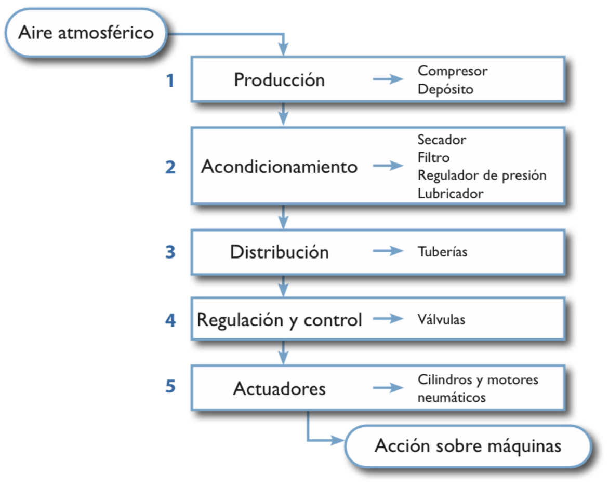

# Introducción {.unnumbered}

Bienvenido a la unidad de **Neumática e Hidráulica** de la asignatura de Tecnología e Ingeniería II. En este bloque estudiaremos cómo el uso de fluidos a presión (aire comprimido y aceite) permite la automatización de procesos industriales y la transmisión de grandes fuerzas con precisión.

## Objetivos de la Unidad

* Comprender las propiedades físicas de los fluidos neumáticos e hidráulicos.
* Identificar y simbolizar correctamente los componentes según la normativa.
* Analizar el funcionamiento de automatismos y diseñar soluciones mediante lógica de fluidos.
* Diferenciar las aplicaciones industriales de la neumática frente a la oleohidráulica.

::: {.content-visible when-format="html"}
::: {.callout-note appearance="simple"}
## 📚 Material de estudio
Puedes descargar esta unidad completa en formato PDF para estudiar sin conexión o imprimirla:

[Descargar Apuntes en PDF](Neumatica_y_Hidraulica.pdf){.btn .btn-primary .btn-lg role="button"}
:::
:::

---

# Bloque I: Circuitos Neumáticos {.unnumbered}

Los circuitos neumáticos están compuestos por una serie de elementos que permiten transformar el aire atmosférico desde que es absorbido hasta que produce una acción mecánica. El flujo de trabajo sigue este orden lógico:

1.  **Generación:** El aire es comprimido y almacenado en un depósito.
2.  **Tratamiento:** El aire se filtra, seca y lubrica (FRL) para proteger los componentes.
3.  **Control y Actuación:** Las válvulas distribuyen el flujo hacia los cilindros, que ejecutan el trabajo final.

## Ventajas de la tecnología neumática

La elección de la neumática en la industria se basa en factores estratégicos:

* **Disponibilidad:** La materia prima (el aire) es gratuita y abundante.
* **Seguridad:** Las fugas no son tóxicas ni inflamables; no hay riesgo de explosión.
* **Robustez:** Los componentes trabajan bien en ambientes con polvo, vibraciones o temperaturas extremas.
* **Simplicidad:** Permite generar movimientos lineales directos sin transmisiones complejas.

## Diagrama de transformaciones del aire

El siguiente esquema resume el ciclo de vida del fluido en un sistema industrial:

{fig-align="center" width="600"}

---

*Última actualización: *